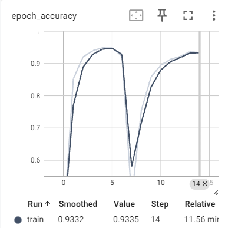

# Major FYP

> Major FYP > Reference Papers

### Useful Links

.pdf)

## Papers
### Image Recognition. 
* EfficientNet [https://arxiv.org/abs/1905.11946] 
    * has been an efficient and accurate benchmark for visual tasks, suitable for using as backbone of downstream fine-tuning tasks.

### Contrastive Learning Approaches:
- Siamese Network [https://api.semanticscholar.org/CorpusID:13874643]
- SimCLR [https://arxiv.org/abs/2002.05709]
- MOCO [https://arxiv.org/abs/1911.05722]
- BYOL [https://arxiv.org/abs/2006.07733]
- InfoNCE [https://arxiv.org/abs/2407.00143]
- Triplet Loss [http://dx.doi.org/10.1109/cvpr.2015.7298682]
- MOCO-v2 [https://arxiv.org/abs/2003.04297]
- SwAV [https://arxiv.org/abs/2006.09882]
- Selectively Hard Triplets Mining [https://arxiv.org/abs/2303.00181]
- CLIP-MOE [https://arxiv.org/abs/2409.19291]
- Survey [https://arxiv.org/abs/2011.00362]
- Fisher Discriminant Triplets & Contrastive Losses [http://dx.doi.org/10.1109/ijcnn48605.2020.9206833]
- Feature suppression problem [https://arxiv.org/abs/2402.11816]

### Gesture Recognition:
- DWPose [https://arxiv.org/abs/2307.15880]
- MediaPipe [https://arxiv.org/abs/1906.08172]
- On-Device Real-Time Hand Gesture Recognition [https://arxiv.org/abs/2111.00038]

### Keypoint Approaches
- An improved hand gesture recognition system using keypoints and hand bounding boxes (2022) [https://doi.org/10.1016/j.array.2022.100251]
    - Two-Stream approach (Image>CNN + Keypoints>Dense > Concat)

### Temporal Approaches:
- TwoStreamNetwork [https://arxiv.org/abs/2211.01367] (with keypoints)
- SlowFastSign [10.1109/ICASSP48485.2024.10445841] (Sign Lang)
- STGCN [http://dx.doi.org/10.24963/ijcai.2018/505]
- STGCN-GR [https://arxiv.org/abs/2312.00553]
- Contrastive Predictive Coding [https://arxiv.org/abs/1807.03748]
- Temporal Contrastive Learning [http://dx.doi.org/10.1016/j.cviu.2022.103406]
- e2eET [https://arxiv.org/abs/2406.15003]
- DYNAMIC HAND GESTURE RECOGNITION BASED ON 3D HAND POSE ESTIMATION FOR HRI (2022) [https://ieeexplore.ieee.org/stamp/stamp.jsp?tp=&arnumber=9427388]
    - Insight for myself: Temporal: 
        - Gesture sequence extracted -> process into discretized "gestures", something like this:
        - 

### Graph contrastive
- GraphCL [https://arxiv.org/pdf/2010.13902]
- Article: Types of contrastive learning [https://jxmo.io/posts/contrastive]

## Datasets

### Hand Gesture Datasets
- HANDS (2021) [https://data.mendeley.com/datasets/ndrczc35bt/1]
    - Paper: [https://doi.org/10.1016/j.dib.2021.106791]
    - RGB-D (depth) dataset, raw format
- SHAPE (2021) [https://users.soict.hust.edu.vn/linhdt/dataset/]
    - Requires request for the dataset via email
- icip17_stereo_hand_pose_dataset (2017) [https://github.com/zhjwustc/icip17_stereo_hand_pose_dataset]
    - Paper: [https://arxiv.org/abs/1610.07214]
    - Image & extracted keypoint sequence (shape: 3 x 21 x 1500)
    - No explicit label on classes
    - "B2 Counting" is from here
    - May be suitable for capturing the essence of continuity
- Creative Senz3D (2015) [https://lttm.dei.unipd.it/downloads/gesture/#senz3d]
    - Paper: [https://lttm.dei.unipd.it/downloads/gesture/senz3d/images/paper.pdf][https://lttm.dei.unipd.it/paper_data/egovision/]
    - 1320 samples, 11 classes, 30 * 4 samples each
    - Idea: can either take as evaluation set, or take as training the smooth transition between gestures.
    - download: [https://lttm.dei.unipd.it/downloads/gesture/senz3d/data/senz3d_dataset.zip]

### ASL Datasets
- How2Sign (2020) [https://how2sign.github.io/#download]
    - Paper: [https://arxiv.org/abs/2008.08143]

## Other Papers

- Text to Gesture
  - Hand1000 (2024)[https://arxiv.org/pdf/2408.15461]
  - HanDiffuser (2024) [https://arxiv.org/pdf/2403.01693]