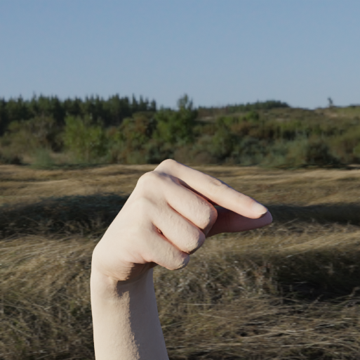
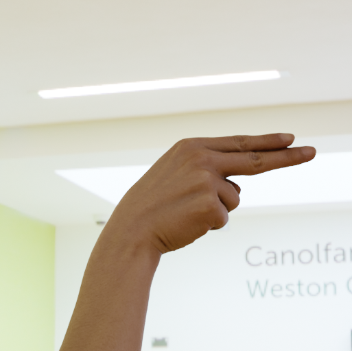
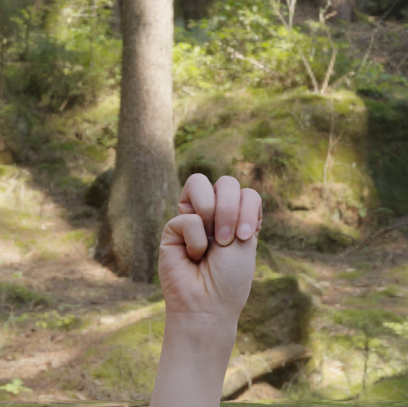
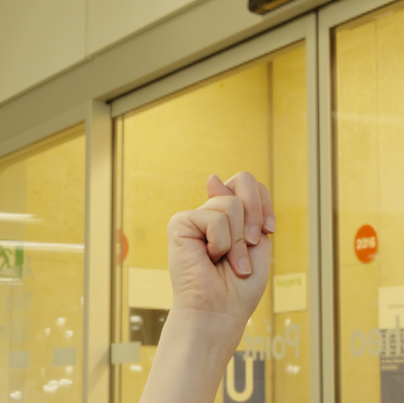
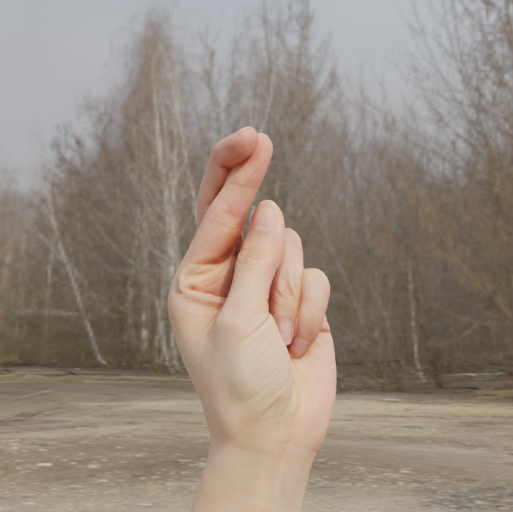
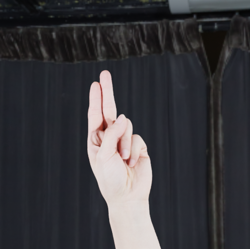
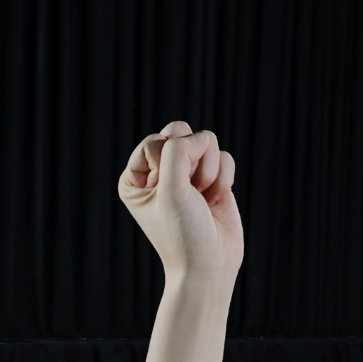
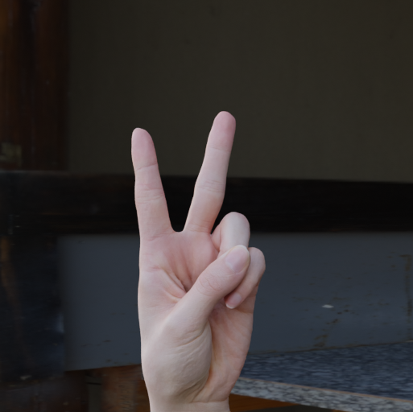
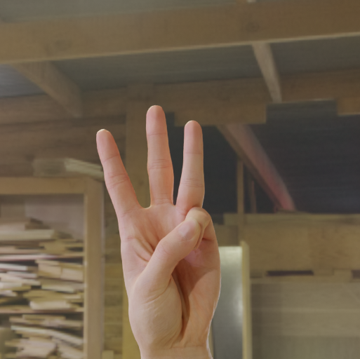

# Major FYP

> Major FYP > Description Doc

### Useful Links

.pdf)

### Notes
* PLEASE UPDATE YOUR PROGRESS IN THE PLANNING DOCUMENT.
* You can attach links to useful papers in the end of the planning document and please add comments properly so that everyone knows why the paper may be useful.
* Please refer to the setup guide (see the panel of buttons on top of this README) to setup the project.
* The materials I've referred to: refer to the midterm report.

### To-Do

> [!IMPORTANT]
> What we will be doing TODAY:
> * Tidy up the specs and think about what augmentations and models to use first.
> * Previously:
>   * Simple EfficientNet+CELoss and EfficientNet+TripletLoss for simple evaluation
> * Next:
>   * Tidy up specs
>   * Augmentations to use
>       * Image-trained (ie image augmentations)
>       * Gesture-trained (ie keypoint extraction)
>   * Writing script for keypoint extraction via mediapipe
>   * Evaluation metrics
>   * Analysis on the latent space graph
>   * Papers (refer to the pdf submitted)

> [!NOTE]
> Mediapipe problem: Cannot detect hands with high stability?

## What do we need to do now?

* Make the project goal and rationale clearer, specific up to the application and details.
* Preliminary analysis on multi-class classification on the ASL dataset, and possibly contrastive learning model on the ASL dataset. Refer to the section [Datasets](#datasets) for more information.

## What will we deliver

* An interface (web or python) for capturing live video from user
* Keypoint extraction (which is easy)
* Connect to the model which we will be developing later, make sure that all models share the same format so that it is easy to integrate the modules later.
* Stage 1: Predicts the STATIC gesture (multi-class)
* Stage 2: Predicts the STATIC gesture (contrastive & cosine similarity)
    * Investigation on if it is possible to generalize a bit on unseen gestures.
    * Problem: requires larger dataset compared to the ASL (which should not be sufficient in theory).
    * Need to find larger dataset (TODO).
* Comparing benchmarks
* Change anything here if you find it bad.

## Progress

* Triplet loss - Implement and study the effects of BATCH HARD NEGATIVES.
* Extraction of skeleton for hands, detecting multiple hands.
* Search for datasets

| **Category** | **CE** | **Triplet** |
| --- | --- | --- |
| **Dataset** |  libs.data.ImageDataset |  libs.data.TripletDataset |
| **Number of Epochs Trained** | 30 | 40 |
| **Loss** |  |  |
| **Test Accuracy** | 0.9889 | 0.8419 (cosine similarity) |
| **TSNE** |    (more focused) |    (may potentially capture more information about similarity of the gestures) |
| **Maximally Confused Classes** | GH; MN; RU; ST; VW | GH; MN; RU; ST; VW |

(tests/3_modularization_test/triplet_loss_raw/modularization_test_inference_triplet_fast.ipynb)
| | |
|--|--|
|  | |
* We can see that the latent space is closer to the perceptual similarity (trained only by 60 epochs!)
* Next: Improve separation while maintaining continuity of the space.
  * Use Tensorboard/whatever to monitor the evolution of the latent space?
  * Training with dynamic dataset to learn "similar" poses.
* Goals: Identify "key" poses from videos...?

(demo/ce_augmented_test.ipynb)
| | |
|--|--|
|  | | 
* 3-layer MLP on Mediapipe results, trained for 20 epochs, achieved test accuracy of 0.9945 (claimed).

Easily Confused Classes

| G | H |
|---|---|
|  |  |
| M | N |
|  |  |
| R | U |
|  |  |
| S | T |
|  |  |
| V | W |
|  |  |

* However, evidently, by training for only 30-40 epochs, the accuracy for triplet loss is significantly lower.
* Going to test on the InfoNCE loss like SimCLR.
* Going to see if using keypoint extraction helps.

## Methodology

### Architecture

Traditionally Gesture Recognition:

#### Image Channel Approach
**Supervised Approach.**
Given labelled image $(I_k,c_k)$, 

$$
I, c \xrightarrow{E(\space\cdot\space)} h \xrightarrow{P(\space\cdot\space)} \hat{c} \xleftrightarrow{\text{CELoss}} c
$$

where, $h$ is the latent representation of the input image $I$, encoded by passing through the EfficientNetB7 encoder $E$, which is then projected using a MLP classifier head $P$. The classification result $\hat{c}$ is then evaluated on Multi-class Cross-Entropy Loss with the true label $c$.

*Problems.* The problems of this approach is that in many cases, it can be costly to obtain high quality labels. That's why we are often motivated to take the contrastive approach to try to make best uses of the unlabelled data too.

**Contrastive Approach.** 

*Triplet Loss.* 
The goal is to minimize the distance between an anchor and a positive sample while maximizing the distance between the anchor and a negative sample. This is achieved by optimizing the following equation:

$$L = \sum_{i=1}^N \max(d(a_i, p_i) - d(a_i, n_i) + \alpha, 0)$$

where $a_i$ is the anchor, $p_i$ is the positive sample, $n_i$ is the negative sample, $d$ is a distance metric, $\alpha$ is a margin, and $N$ is the number of triplets.

*Siamese Network.*
Given pairs or triplets $I_1,I_2,...,I_k$, evaluate the projected latents with a shared encoder and projection model $E$ and $P$, i.e. $h_k=E(I_k), z_k=P(z_k)$.

*SimCLR.*
The approach uses InfoNCE loss alongside augmentations...

#### Incoporating Keypoint Channel

Two types of methods:
* Image-based: Use keypoint channel only to highlight specific features, not using the keypoints directly as a graph
    * Example: TwoStreamNetwork (2022), e2eET (2024)
* Graph-based: Use the keypoints as graphs to train an GNN
    * Example: STGCN-GR (2023) (which does NOT use the keypoints, but instead uses the muscle signals to construct a network)

### Augmentations
* augments: angle (within 20 degrees difference)
* keypoints extraction

## Project Requirements
### Hardware

* We also need to confirm what devices do we need / are available.
* Personally Sam have two devices, one with RTX 4070 (laptop), one with RTX 3060Ti (desktop), possibly able to use the RTX 4070 + 4060 in the internship company with constraints.
* Kaggle available: T4 / P100 (30 hr / week, timeout 12 hr)

## Difficulties

The difficulty of this project - which turned out to be too ambitious - includes the following:

1. Contrastive Learning
   * Current progress: Siamese Network + Triplet Loss
       * Dataset: [face dataset](https://www.kaggle.com/datasets/stoicstatic/face-recognition-dataset/)
       * Reference Implementation: [tensorflow: siamese network](https://www.kaggle.com/code/tatianakushniruk/face-recognition-with-siamese-network/notebook)
       * Progress: Execution successful on both Kaggle notebooks and local. Code will be updated later.

         * 
             * Trained without learning rate decay, so the performance is not as good (the face dataset consists of 1680 people and around 8-9 samples each)
         * 
             * Trained with learning rate decay, extended patience, result is still not very satisfactory.
             * The similarity matrix (max cosine similarity): 
             * 
             * Min cosine similarity:
             * 
             * Direct comparison of the maximum inter-class cosine similarities and minimum intra-class cosine similarities:
             * 
             * We can observe that the current set does not work very well, as the diagonal values are NOT always the highest value within the group - that is, during recognition, SOME faces would still get misclassified.
             * But from the mean:
             * 
             * we can see that in general most faces should get classfied correctly (further analsysis required).
         * T-SNE result on 15 distinct faces:
             * 
             * The clusters are clearly visible, indicating that they might still be easily separable.

         * **Directions**: the original source did NOT generate new triplets for every iteration. This causes the triplets (specific anchor-positive-negative triplets) to be reused instead of fully utilizing the available images.
2. Time Series
   * Involves sequential data - dynamic gesture sequences. This can be complicated for starters, so we may first focus on static gestures.
3. Graph
   * It may be a viable and feasible option to utilize the **keypoints** captured from the gestures instead of the images/videos to train a classification / contrastive model. 
   * This way, we can perform more augmentations easily like offsetting the keypoints slightly, rotating the entire palm slightly, etc.. This is not possible on the raw image/video data.
    * STGCN Progress

        * Progress: Spatio-Temporal Graph Convolutional Neural Netowrk - (STGCN) with multi-class classification (during internship).
        * Preliminary analysis showed that it achieved around 90%+ accuracy trained just for a short amount of time **on a 20-class classification problem** for sign language.
        * Trained based on cropped and speed-adjusted gesture keypoint sequences.
        * 
        * Mostly rely on my compnay senior's advise, so will need to reformulate and refactor the entire project in order to maintain a consistent style.

        * Need to solve: the accuracy instability issue.
        * The augmentations are not sufficient.

4. Adaptive Learning "on the fly"
   * This can basically be solved with contrastive learning.
5. Generalizing with unseen data with minimal retraining.
   * Suspect that this could be solved with contrastive learning.
   * Similar is done with this paper: 
       * E. Uboweja, D. Tian, Q. Wang, et al., On-device real-time custom hand gesture recognition, 2023. arXiv: 2309.10858 [cs.CV]. [Online]. Available: https://arxiv.org/abs/2309.10858.
       * In this paper, they trained a word-level fingerspelling model which utilizes a single-hand embedding sub-model to extract discriminative features as feature vectors - the weights are the transferred to a new model for training a custom gesture recognition model with minimal training data.
6. Small labelled dataset, with large unlabelled dataset.
    * This is not our first priority. 
    * This is a problem in the semi-supervised learning, and shares a lot of common characteristics with problems within contrastive learning.

Reference: video (temporal contrastive learning): https://arxiv.org/pdf/2101.07974

Contrastive good? https://arxiv.org/pdf/2011.13377 (tradeoffs) https://arxiv.org/pdf/2112.05340

## Datasets

### Static Datasets

* ASL alphabets [[go](https://www.kaggle.com/datasets/lexset/synthetic-asl-alphabet)]

Goal: Comparison of performance of multiclass classification and contrastive learning.

### Dynamic Datasets

Goals: control the screen (touchless screen control)

* IPN Hand [[go](https://gibranbenitez.github.io/IPN_Hand/)]
<!-- * DHGD: Dynamic Hand Gesture Dataset for Skeleton-Based Gesture Recognition and Baseline Evaluations (Access via CUHK lib) [[go](https://ieeexplore-ieee-org.easyaccess1.lib.cuhk.edu.hk/document/10444226)] -->

* JESTER dataset [[go](https://www.kaggle.com/datasets/toxicmender/20bn-jester)]
* (Not accesible yet) DVS128 dataset [[go](https://coldpress.ai/product_page/1680201883079x468828458487031500)]

Goals: Generalizability over unseen gestures with minimal samples.

* E. Uboweja, D. Tian, Q. Wang, et al., On-device real-time custom hand gesture recognition, 2023. arXiv: 2309.
10858 [cs.CV]. [Online]. Available: https://arxiv.org/abs/2309.10858.
    * They trained a word-level fingerspelling model which utilizes a single-hand embedding sub-model to extract discriminative features as feature vectors - the weights are the transferred to a new model for training a custom gesture recognition model with minimal training data.

Goals: Generalizability over unseen gestures, including different body parts (including face, etc) - with minimal samples for retraining.

* HKSL reference (http://www.cslds.org/v4/)
    * Sign language investigation: https://www.sciencedirect.com/science/article/pii/S0024384121001601
    * Hard negatives & Phrasal separation (CANNOT (ability) vs CANNOT (permission))
    * Adapting to varying speeds of making the signs.
    * Names and context getting.

Goals: Sign language interpretation without the need to pretrain every gloss.

Goals: Extract extra information - like **distance**, **direction**, **object in contact**, etc. from the gesture.

## In the Future...

* Long-term motion characteristics [https://link.springer.com/article/10.1007/s13042-023-01987-3]
* Procedures to do:
    * Efficiency
    * Back tracking (attention / etc)
    * Review of methods
    * New method
      * Capturing based on skeleton (MediaPipe)
      * Combined channel method based on TwoStreamSLT
      * ? Distillation methods (just reducing size of model)
      * ? Boosting efficiency of networks
      * It is okay to fail to exceed their benchmark (afterall we are undergrads)
