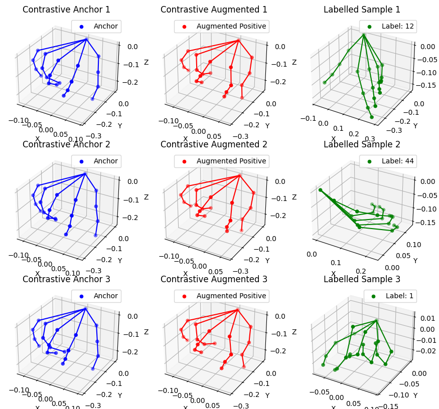
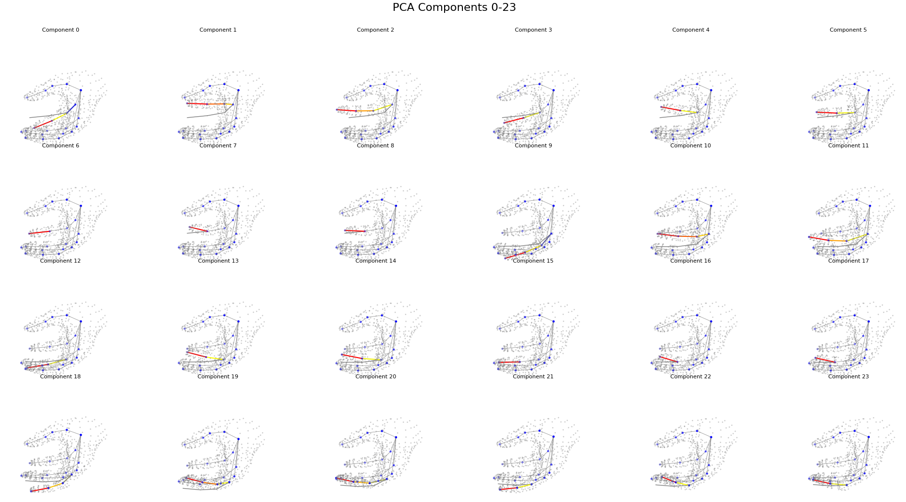
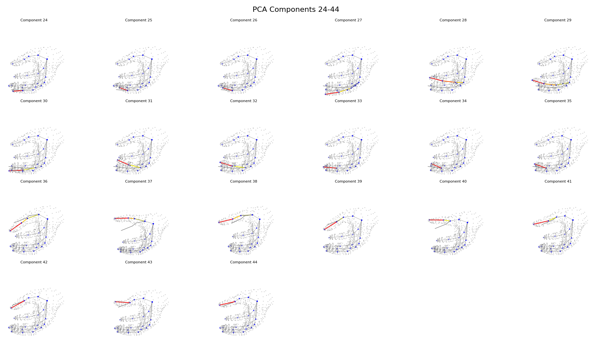

# KTL2401 General Hand Gesture Recognition

## Quick Links
* **Resources:** [Datasets](/docs/README-datasets.md) | [Dataset Download Instructions](/docs/README-folders-datasets.md) | [Papers](docs/README-papers.md) 
* **Drafts:** [Planning Document](https://1drv.ms/w/s!Ago9nLnz9h82gosJqjlnjoOBK9SS-Q?e=YuU6Wy) | [LaTeX Drafts](https://www.overleaf.com/6774289999vrsjksvmvfch#f96db3)
* **Reports:** [Planning Report](/docs/KTL2401_1155175983_1155174636_planning_report.pdf) | 
[First Term Report](/docs/KTL2401_1155175983_1155174636_final_report.pdf)
* **Progress:** [Progress Document](/docs/README-progress.md)

> [!NOTE]
> Please read the [Progress Document](/docs/README-progress.md) to see the current progress.

## Goals

* **Adaptation.** Allowing for quick adaptation to new set of data without full-scale re-training.

## Approach

* **Contrastive Pre-training.** Utilizes contrastive learning to 

## Setting Up

### Environment

* **System Requirement:**
    * Requires: Python 3.10, CUDA 11.8, CUDNN 8
* **Virtual Environment:** 
    1. Create and enter virtual environment (expect this will require around 15 minutes).
        ```bash
        # on windows cmd
        virtualenv -p python3.10 venv # create venv
        .\venv\Scripts\activate # enter venv

        # on wsl/linux
        python3.10 -m venv env # create env
        source env/bin/activate # enter env

        # please remember to set your default interpreter to venv or env.
        ```
    2. `pip install -r requirements.txt` 
* **Data Architecture:**
  * All data are stored within the directory `data/raw` and the processed data are stored under `data/kpts`.
  * Download the datasets according to [this document](/docs/README-folders-datasets.md).

### Data Extraction

* For the following datasets, perform `python scripts/datasets/prepare_dataset.py <dataset_name>`, where `<dataset_name>` is one of the followings:
  * Static: `lexset` (`synthetic-asl-alphabet`), `senz3d` (`senz3d_dataset`), `handshape` (`ph2014-handshape`).
* Fixing: `python scripts/datasets/_fix_holistic.py -d <dataset_name> -s <split_name>` if there are two hands within the video guaranteeed.
* Fixing: `python scripts/datasets/_fix_left_right_hands.py -d <dataset_name> -s <split_name>`
* Verification: `python scripts/datasets/dataset_loader.py -d <dataset_name> -s <split_name>`

## Training

### Folder Architecture

- Dataset preparation: under `scripts/datasets`.
- Dataset for hand-only contrastive training: under `scripts/fake_data` and `scripts/hand_only_supervised`.
- Unsupervised contrastive training (InfoNCE loss) (v3): `python training/contrastive/train_contrastive_fake_data.py`.


## What's NEW

- Pre-generation of contrastive data:
  - `scripts/fake_data/prepare_fake_data_npy.py`, `training/contrastive/train_supcon_1.py`, `augments.py`, `contrastive_data_dataset_3.py`.
    - OUT: runs/hand_contrastive_learning/v4/20250401140023/checkpoints/best.pth
  - `scripts/fake_data/prepare_fake_data_npy_2.py`, `training/contrastive/train_supcon.py`, `augments.py`, `contrastive_data_dataset.py`.
    - Separate rotation and class augmentations and batch them into the SAME infoNCE pass so as to allow the model to learn the two info together.
    - 20250402210020: Rotation 
  - Baseline: Directly use landmarks to evaluate: (none)
    - Lexset: 

```
Test Accuracy: 0.9000
Test F1 Score: 0.8930
Class accu: {0: 0.91, 1: 0.95, 2: 0.97, 3: 0.82, 4: 0.95, 5: 0.96, 6: 0.96, 7: 0.96, 8: 0.95, 9: 0.94, 10: 0.94, 11: 0.94, 12: 0.93, 13: 0.93, 14: 0.96, 15: 0.93, 16: 0.95, 17: 0.96, 18: 0.94, 19: 0.96, 20: 0.91, 21: 0.97, 22: 0.94, 23: 0.87, 24: 0.91, 25: 0.89, 26: 0.0}
Class f1: {0: 0.9528795811518325, 1: 0.9743589743589743, 2: 0.9847715736040609, 3: 0.9010989010989011, 4: 0.9743589743589743, 5: 0.9795918367346939, 6: 0.9795918367346939, 7: 0.9795918367346939, 8: 0.9743589743589743, 9: 0.9690721649484536, 10: 0.9690721649484536, 11: 0.9690721649484536, 12: 0.9637305699481865, 13: 0.9637305699481865, 14: 0.9795918367346939, 15: 0.9637305699481865, 16: 0.9743589743589743, 17: 0.9795918367346939, 18: 0.9690721649484536, 19: 0.9795918367346939, 20: 0.9528795811518325, 21: 0.9847715736040609, 22: 0.9690721649484536, 23: 0.9304812834224598, 24: 0.9528795811518325, 25: 0.9417989417989417, 26: 0.0}
```
  - model_checkpoint_path = 'runs/hand_contrastive_learning_structured/v1/20250403104741/checkpoints/best.pth'
```
Test Accuracy: 0.8967
Test F1 Score: 0.8971
Class accu: {0: 0.9, 1: 0.96, 2: 0.96, 3: 0.79, 4: 0.89, 5: 0.96, 6: 0.98, 7: 0.98, 8: 0.78, 9: 0.83, 10: 0.93, 11: 0.92, 12: 0.89, 13: 0.92, 14: 0.96, 15: 0.88, 16: 0.75, 17: 0.87, 18: 0.91, 19: 0.93, 20: 0.9, 21: 0.98, 22: 0.96, 23: 0.78, 24: 0.72, 25: 0.89, 26: 0.99}
Class f1: {0: 0.9473684210526315, 1: 0.9795918367346939, 2: 0.9795918367346939, 3: 0.8826815642458101, 4: 0.9417989417989417, 5: 0.9795918367346939, 6: 0.98989898989899, 7: 0.98989898989899, 8: 0.8764044943820225, 9: 0.907103825136612, 10: 0.9637305699481865, 11: 0.9583333333333335, 12: 0.9417989417989417, 13: 0.9583333333333335, 14: 0.9795918367346939, 15: 0.9361702127659575, 16: 0.8571428571428571, 17: 0.9304812834224598, 18: 0.9528795811518325, 19: 0.9637305699481865, 20: 0.9473684210526315, 21: 0.98989898989899, 22: 0.9795918367346939, 23: 0.8764044943820225, 24: 0.8372093023255814, 25: 0.9417989417989417, 26: 0.9949748743718593}
```
- Think of a good augmentation and contrastive learning technique.
- UPDATE: Spotted big problem in previous script for generating fake hands (noted: wrong association of landmark ids).
- `scripts/fake_data/prepare_fake_data_npy_3.py`, `training/contrastive/train_supcon.py`, `augments.py`, `contrastive_data_dataset.py`.

- Checking unsupervised and supervised dataset hand formulation: python training/contrastive/test_contrastive_fake_data.py



## MANO features



```
assume z up, this z have nothing to do with the actual coords
0-2: index finger node, rotate (xy) away from thumb, rotate (xz) left/right towards thumb, rotate front/back
3-5: index finger node 2, rotate xy, rotate left/right, rotate forward
6-8: index finger node 3, rotate xy, rotate left/right, rotate forward, 

9-17, same but for middle finger
18-26, same but pinky
27-35, same but second last finger
36-44, same but thumb

2,5,8
```

- Problem: Actually the handshapes generated SOMETIMES DO NOT MODEL ALL POSSIBLE STRANGE HANDSHAPES.
- Limitations in hard handshapes.

* KNN results for 3DOF classfier (quat, `eval_dataset` with `get_3dof`):
```
Evaluating the model using k-NN...
Test Accuracy: 0.9130
Test F1 Score: 0.9128
Class accu: {0: 0.90625, 1: 0.8947368421052632, 2: 0.9896907216494846, 3: 0.9186046511627907, 4: 0.8936170212765957, 5: 0.968421052631579, 6: 0.8979591836734694, 7: 0.9896907216494846, 8: 0.9468085106382979, 9: 0.9468085106382979, 10: 0.9375, 11: 0.9263157894736842, 12: 0.8241758241758241, 13: 0.968421052631579, 14: 0.9795918367346939, 15: 0.8315789473684211, 16: 0.8723404255319149, 17: 0.9052631578947369, 18: 0.8210526315789474, 19: 0.8969072164948454, 20: 0.9361702127659575, 21: 0.9680851063829787, 22: 0.9042553191489362, 23: 0.8085106382978723, 24: 0.8837209302325582, 25: 0.9111111111111111}
Class f1: {0: 0.9508196721311476, 1: 0.9444444444444443, 2: 0.9948186528497409, 3: 0.9575757575757575, 4: 0.9438202247191011, 5: 0.983957219251337, 6: 0.946236559139785, 7: 0.9948186528497409, 8: 0.9726775956284153, 9: 0.9726775956284153, 10: 0.967741935483871, 11: 0.9617486338797814, 12: 0.9036144578313253, 13: 0.983957219251337, 14: 0.9896907216494845, 15: 0.9080459770114941, 16: 0.9318181818181817, 17: 0.9502762430939228, 18: 0.9017341040462427, 19: 0.9456521739130435, 20: 0.967032967032967, 21: 0.9837837837837837, 22: 0.9497206703910615, 23: 0.8941176470588236, 24: 0.9382716049382716, 25: 0.9534883720930233}
```

* 3DOF:
```
Evaluating the model using k-NN...
Test Accuracy: 0.9273
Test F1 Score: 0.9270
Class accu: {0: 0.8854166666666666, 1: 0.9368421052631579, 2: 0.979381443298969, 3: 0.9418604651162791, 4: 0.9361702127659575, 5: 0.9894736842105263, 6: 0.9081632653061225, 7: 1.0, 8: 0.9787234042553191, 9: 0.9787234042553191, 10: 0.9270833333333334, 11: 0.9368421052631579, 12: 0.8131868131868132, 13: 0.9368421052631579, 14: 0.9693877551020408, 15: 0.8842105263157894, 16: 0.9148936170212766, 17: 0.9052631578947369, 18: 0.8421052631578947, 19: 0.865979381443299, 20: 0.925531914893617, 21: 0.9893617021276596, 22: 0.9468085106382979, 23: 0.8297872340425532, 24: 0.9069767441860465, 25: 0.9777777777777777}
Class f1: {0: 0.9392265193370166, 1: 0.9673913043478259, 2: 0.9895833333333335, 3: 0.9700598802395208, 4: 0.967032967032967, 5: 0.9947089947089947, 6: 0.9518716577540107, 7: 1.0, 8: 0.9892473118279569, 9: 0.9892473118279569, 10: 0.9621621621621622, 11: 0.9673913043478259, 12: 0.896969696969697, 13: 0.9673913043478259, 14: 0.9844559585492226, 15: 0.9385474860335196, 16: 0.9555555555555556, 17: 0.9502762430939228, 18: 0.9142857142857144, 19: 0.9281767955801103, 20: 0.9613259668508287, 21: 0.9946524064171123, 22: 0.9726775956284153, 23: 0.9069767441860465, 24: 0.9512195121951219, 25: 0.9887640449438202}
```

* 6DOF:
```
Test Accuracy: 0.9322
Test F1 Score: 0.9320
Class accu: {0: 0.8958333333333334, 1: 0.9473684210526315, 2: 0.9896907216494846, 3: 0.9418604651162791, 4: 0.925531914893617, 5: 0.9894736842105263, 6: 0.9081632653061225, 7: 1.0, 8: 1.0, 9: 0.9787234042553191, 10: 0.9375, 11: 0.9368421052631579, 12: 0.8131868131868132, 13: 0.9473684210526315, 14: 0.9693877551020408, 15: 0.9052631578947369, 16: 0.9574468085106383, 17: 0.9052631578947369, 18: 0.8526315789473684, 19: 0.865979381443299, 20: 0.9361702127659575, 21: 0.9893617021276596, 22: 0.9361702127659575, 23: 0.8297872340425532, 24: 0.9186046511627907, 25: 0.9555555555555556}
Class f1: {0: 0.9450549450549449, 1: 0.972972972972973, 2: 0.9948186528497409, 3: 0.9700598802395208, 4: 0.9613259668508287, 5: 0.9947089947089947, 6: 0.9518716577540107, 7: 1.0, 8: 1.0, 9: 0.9892473118279569, 10: 0.967741935483871, 11: 0.9673913043478259, 12: 0.896969696969697, 13: 0.972972972972973, 14: 0.9844559585492226, 15: 0.9502762430939228, 16: 0.9782608695652174, 17: 0.9502762430939228, 18: 0.9204545454545454, 19: 0.9281767955801103, 20: 0.967032967032967, 21: 0.9946524064171123, 22: 0.967032967032967, 23: 0.9069767441860465, 24: 0.9575757575757575, 25: 0.9772727272727273}
```

* `train_supcon.py` on desktop before 202504031508.
* using `train_unsup.py` on desktop (before 20250404163732).
* `train_supcon_gat.py` and `train_unsup_gat.py` (have text logs).
* Direction: Larger datasets needed?