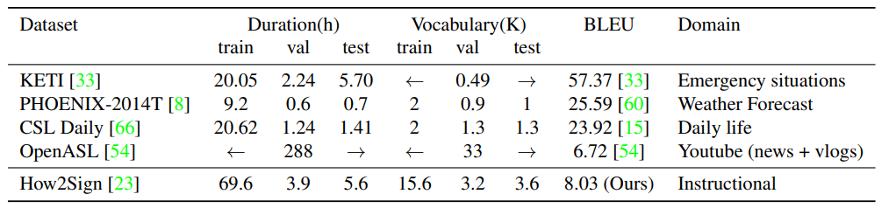

## Datasets
[Back](/README.md)

### Metrics For Performance
* FLOPs, memory usage

### Static Gestures
#### Metrics
* Test accuracy, precision, recall, f1 score

#### Hand Gesture Datasets
- **SHAPE** (2021) [https://users.soict.hust.edu.vn/linhdt/dataset/]
    - Requires request for the dataset via email
- Creative Senz3D | Exploiting Silhouette Descriptors and Synthetic Data for Hand Gesture Recognition (2015) [https://lttm.dei.unipd.it/downloads/gesture/#senz3d]
    - Paper: [https://lttm.dei.unipd.it/downloads/gesture/senz3d/images/paper.pdf][https://lttm.dei.unipd.it/paper_data/egovision/]
    - 1320 samples, 11 classes, 30 * 4 samples each
    - Shows only limited rotations of the same gesture for the 4 signers.
    - Idea: can either take as evaluation set, or take as training the smooth transition between gestures.
    - download: [https://lttm.dei.unipd.it/downloads/gesture/senz3d/data/senz3d_dataset.zip]
    - Link seems to be broken but Sam have a copy
- **HaGRID** | HaGRIDv2: 1M Images for Static and Dynamic Hand Gesture Recognition (2024) [https://github.com/hukenovs/hagrid]
  - 1.5T and dataset contains 1,086,158 FullHD RGB images divided into 33 classes of gestures
  - Paper: [https://arxiv.org/abs/2412.01508]

#### Sign Language Datasets
- Synthetic ASL Alphabet, Lexset (2022) [https://www.kaggle.com/datasets/lexset/synthetic-asl-alphabet]
  - 27 classes, 27,000 images in total, 900/100 examples per class, 512x512
- ASL Alphabet Dataset (2018) [https://www.kaggle.com/datasets/grassknoted/asl-alphabet]
  - 29 classes, 87,000 images in total, 200x200
  - Very poor lighting conditions
- **PHOENIX_Weather_2014MS_Handshapes dataset** | Deep Hand: How to Train a CNN on 1 Million Hand Images When Your Data is Continuous and Weakly Labelled (2016) [https://www-i6.informatik.rwth-aachen.de/~koller/1miohands-data/]
  - Paper: [https://doi.org/10.1109/CVPR.2016.412]
  - 3359 images, 45 pose-independent hand shape classes, imbalanced.
  - 

### Continuous Gestures
#### Hand Gesture Dataset
- **icip17_stereo_hand_pose_dataset** | A hand pose tracking benchmark from stereo matching (2017) [https://github.com/zhjwustc/icip17_stereo_hand_pose_dataset]
    - Paper: [https://arxiv.org/abs/1610.07214]
    - Image & extracted keypoint sequence (shape: 3 x 21 x 1500)
    - No explicit label on classes
    - "B2 Counting" is from here
    - May be suitable for capturing the essence of continuity

### Dynamic Gestures
#### Metrics
* **Sign Language:** 
  * Sign2Text task / Sign Language Translation (SLT):
    * BLEU | BLEU: a Method for Automatic Evaluation of Machine Translation (2002) [https://aclanthology.org/P02-1040.pdf]
    * rBLEU: Blacklisting frequent non-contextual words (articles, prepositions, pronouns) | Sign Language Translation from Instructional Videos (2023) [https://arxiv.org/pdf/2304.06371]
    * Rouge-1/2: Measuring the unigram/bigram precision, recall or F1 score (often F1 score)
    * Rouge-L: similar to rogue-1, but numerator is length of LCS of reference and the generated text.
  * Sign2Gloss task / Sign Language Recognition (SLR):
    * Word Error Rate (WER)

#### Hand Gesture Datasets
- **HANDS** | HANDS: an RGB-D dataset of static hand-gestures for human-robot interaction (2021) [https://data.mendeley.com/datasets/ndrczc35bt/1]
    - Paper: [https://doi.org/10.1016/j.dib.2021.106791]
    - RGB-D (depth) dataset, raw format
    - 2400 frames per subject, 5 subjects, rgb+depth
    - 29 classes considering different variants of the same gesture, 15 classes without considering the variants.
    - 
- **LMDHG Dataset** | Dynamic hand gesture recognition based on 3D pattern assembled trajectories (2017) [https://www-intuidoc.irisa.fr/en/english-leap-motion-dynamic-hand-gesture-lmdhg-database/]
  - Paper: [https://ieeexplore.ieee.org/document/8310146]
  - Contains unsegmented sequences of hand gestures performed with either one hand or both hands
  - 13 classes
  - 
- **FPHA Dataset** | First-Person Hand Action Benchmark with RGB-D Videos and 3D Hand Pose Annotations (2018) [https://guiggh.github.io/publications/first-person-hands/]
  - RGB-D videos, 100K frames of 45 daily hand action categories, involving 26 different objects in several hand configurations
  - 6D object poses and provide 3D object models for a subset of hand-object interaction sequences available
  - Challenge: low ratio of gesture sequences (1175) to gesture classes (45)
  - Paper: [https://arxiv.org/abs/1704.02463]
- **JESTER Dataset** [https://www.qualcomm.com/developer/software/jester-dataset/downloads]
  - Dynamic dataset with 148,092 videos and 27 labels
  - 118,562/14,787/14,743 videos each
  - 100px x 100px, 12 fps
  - more than 1,300 unique crowd actors
  - 
- **IPN Hand Dataset** | IPN Hand: A Video Dataset and Benchmark for Real-Time Continuous Hand Gesture Recognition (2020) [https://gibranbenitez.github.io/IPN_Hand/]
  - Paper: [https://arxiv.org/abs/2005.02134]

#### Sign Language Datasets

- **How2Sign** | How2Sign: A Large-scale Multimodal Dataset for Continuous American Sign Language (2020) [https://how2sign.github.io/#download]
    - Paper: [https://arxiv.org/abs/2008.08143]
    - Provides all modalities of multiview, transciption, gloss, pose, depth and speech.
    - 
    - Total  31,128 / 1,741 / 2,322 = 35,191 clips
    - Total  6.3M / 362,319 / 521,219 = 7.2M frames
    - Green screen
    - Each clip has avg 162 frames and 17 words.
    - 
- LSA64: A Dataset for Argentinian Sign Language [https://facundoq.github.io/datasets/lsa64/]
  - Paper: [http://sedici.unlp.edu.ar/bitstream/handle/10915/56764/Documento_completo.pdf-PDFA.pdf?sequence=1&isAllowed=y]
  - 64 signs, 3200 videos
- **LSA64** | LSA64: A Dataset of Argentinian Sign Language (2016) [https://facundoq.github.io/datasets/lsa64/]
  - Paper: [http://sedici.unlp.edu.ar/bitstream/handle/10915/56764/Documento_completo.pdf-PDFA.pdf?sequence=1&isAllowed=y]
  - Argentinian Sign Language, 64 signs, 3200 videos; 1.5 GB.
  - One or both hands.
- **PHOENIX-Weather 2014-T dataset** | Neural Sign Language Translation (2018) [https://www-i6.informatik.rwth-aachen.de/~koller/RWTH-PHOENIX-2014-T/]
  - Paper: [https://openaccess.thecvf.com/content_cvpr_2018/html/Camgoz_Neural_Sign_Language_CVPR_2018_paper.html]
  - 39GB, >0.95M frames, >67K signs, vocab >1K and >99K words from German vocab of >2.8K
- American Sign Language Lexicon Video Dataset (ASLLVD) [https://www.bu.edu/asllrp/av/dai-asllvd.html]
  - Closed
- Hong Kong Sign Language Dataset [http://www.cslds.org/v4/]
  - Requires access