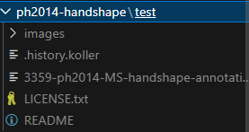
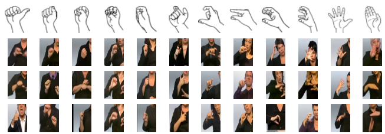
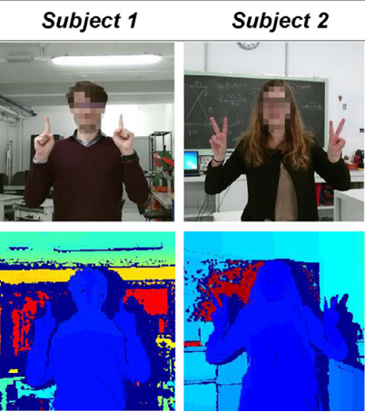
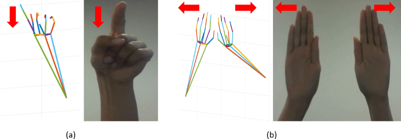
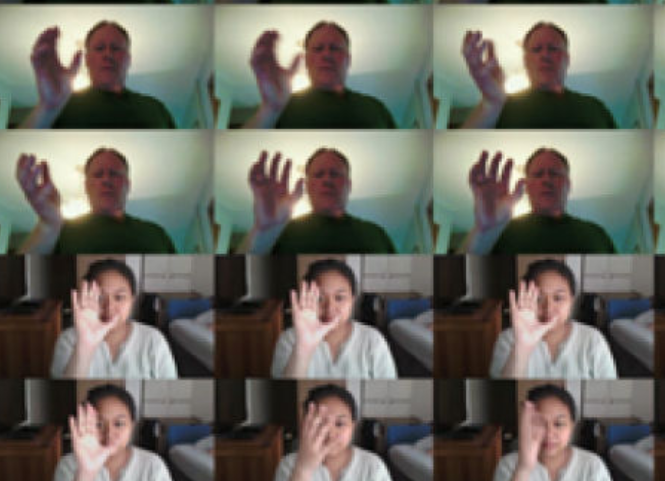
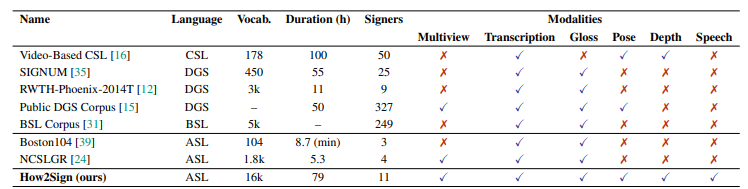
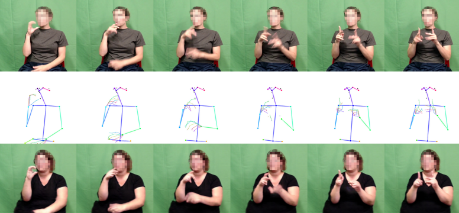

## Datasets
[Back](/README.md)

### Prerequsites

* Using WSL, linux or macOS to run the scripts for downloading and unzipping the datasets.
* Make sure that you have done `sudo apt-get install wget p7zip-full unzip pv dos2unix` (you may need to `sudo`), or the script will terminate without achieving what we expect.
  * If there are strange characters `\r` following the zip names or folder names, run `dos2unix <script_path>` before executing the scripts.
* Fixing PROTOBUF problem (powershell, modify if using linux/macOS):
    * Execute: `wget https://raw.githubusercontent.com/protocolbuffers/protobuf/main/python/google/protobuf/internal/builder.py -O venv/Lib/site-packages/google/protobuf/internal/builder.py`

### Static Gestures
#### Hand Gesture Datasets
- Creative Senz3D | [Source](https://lttm.dei.unipd.it/downloads/gesture/#senz3d) | [Paper](https://lttm.dei.unipd.it/downloads/gesture/senz3d/images/paper.pdf) | [Website](https://lttm.dei.unipd.it/paper_data/egovision/)
    - **Download**: Run `./data/scripts/dl_senz3d.bash`  in WSL, linux or macOS at root directory.
    - **Path**: `dataraw/senz3d_dataset`
    - **Subfolders**:
      - `acquisitions/S[i]/G[j]/` (signer $i\in[1,4]$, gesture $j\in[1,11]$)
        - Contains:
          - `[k]-color.png`
          - `[k]-conf.bin`
          - `[k]-depth.bin`
        - id $k\in[1,30]$.
    - **Description**: 
      - 1320 samples, 11 classes, 30 * 4 samples each
      - Shows only limited rotations of the same gesture for the 4 signers.
      - Idea: can either take as evaluation set, or take as training the smooth transition between gestures.
<!-- - **HaGRID** | HaGRIDv2: 1M Images for Static and Dynamic Hand Gesture Recognition (2024) [https://github.com/hukenovs/hagrid]
  - 1.5T and dataset contains 1,086,158 FullHD RGB images divided into 33 classes of gestures
  - Paper: [https://arxiv.org/abs/2412.01508] -->

#### Sign Language Datasets
- Synthetic ASL Alphabet, Lexset (2022) | [Source](https://www.kaggle.com/datasets/lexset/synthetic-asl-alphabet)
  - **Download**:
    ```bash
    # cmd
    kaggle datasets download -d lexset/synthetic-asl-alphabet
    mkdir "data/raw/synthetic-asl-alphabet"
    tar -xf synthetic-asl-alphabet.zip -C data/raw/synthetic-asl-alphabet
    ```
    Search for Download guides for the kaggle command if it is not working.
  - **Path**: `data/raw/synthetic-asl-alphabet/`
  * **Subfolders**: 
    * train: `Train_Alphabet`
    * test: `Test_Alphabet`
    * `[Train/Test]_Alphabet/[c]/<filename>.png`: rgb image
      * `c`: class name, upper case A-Z + Blank.
      * `<filename>`: no structure in file name.
  - **Description**: 27 classes, 27,000 images in total, 900/100 examples per class, 512x512
- ASL Alphabet Dataset (2018) [https://www.kaggle.com/datasets/grassknoted/asl-alphabet]
  - **Download**:
    ```bash
    # cmd
    kaggle datasets download -d "grassknoted/asl-alphabet"
    mkdir "data/raw/asl_alphabet"
    tar -xf asl-alphabet.zip -C data/raw/asl_alphabet
    ```
    Search for Download guides for the kaggle command if it is not working.
  - **Description**:
    - 29 classes, 87,000 images in total, 200x200
    - Very poor lighting conditions
    - Only hand
- **PHOENIX_Weather_2014MS_Handshapes dataset** | [Source](https://www-i6.informatik.rwth-aachen.de/~koller/1miohands-data/) | [Paper](https://doi.org/10.1109/CVPR.2016.412)
  - **Download**: 
      - Execute `./data/scripts/dl_handshape_test.bash` and `./data/scripts/dl_handshape_train.bash` in WSL, linux or macOS.
  - **File structure**: 
  - **Description**: 3359 images, 45 pose-independent hand shape classes, highly imbalanced.
  - 

### Continuous Gestures
#### Hand Gesture Dataset
- **icip17_stereo_hand_pose_dataset** | [Source](https://github.com/zhjwustc/icip17_stereo_hand_pose_dataset) | [Paper](https://arxiv.org/abs/1610.07214)
    - **Path**: `data/raw/B2Counting`.
    - **Description**: 
      - Image & extracted keypoint sequence (shape: 3 x 21 x 1500)
      - No explicit label on classes
      - May be suitable for capturing the essence of continuity

### Dynamic Gestures
#### Hand Gesture Datasets
- **SHREC’21** | SHREC 2021 Gesture Benchmark [https://univr-vips.github.io/Shrec21/]
    - Landmarks provided.
- **HANDS** | [Source](https://data.mendeley.com/datasets/ndrczc35bt/1) | [Paper](https://doi.org/10.1016/j.dib.2021.106791)
    - **Download**: 
      - Execute `./data/scripts/dl_hands.bash` in WSL, linux or macOS.
    - **Description**: 
      - RGB-D (depth) dataset, raw format
      - 2400 frames per subject, 5 subjects, rgb+depth
      - 29 classes considering different variants of the same gesture, 15 classes without considering the variants.
      - Both hand and some only have one hand.
      - 
    - **Format of Labels**:
      - Within `Subject{i}/Subject{i}.txt`:
      - `rgb` and `depth`: path to that image.
      - `{gesture}_VF{L/R}`: 
        - `{L/R}`: left/right hand
        - `{gesture}`: the gesture
        - If the entry in that cell is `[0,0,0,0]`, the class is not there.
        - Else, the set of values is the bounding box.
<!-- - **LMDHG Dataset** | Dynamic hand gesture recognition based on 3D pattern assembled trajectories (2017) [https://www-intuidoc.irisa.fr/en/english-leap-motion-dynamic-hand-gesture-lmdhg-database/]
  - Paper: [https://ieeexplore.ieee.org/document/8310146]
  - Contains unsegmented sequences of hand gestures performed with either one hand or both hands
  - 13 classes
  - 
- **FPHA Dataset** | First-Person Hand Action Benchmark with RGB-D Videos and 3D Hand Pose Annotations (2018) [https://guiggh.github.io/publications/first-person-hands/]
  - RGB-D videos, 100K frames of 45 daily hand action categories, involving 26 different objects in several hand configurations
  - 6D object poses and provide 3D object models for a subset of hand-object interaction sequences available
  - Challenge: low ratio of gesture sequences (1175) to gesture classes (45)
  - Paper: [https://arxiv.org/abs/1704.02463]
- **JESTER Dataset** [https://www.qualcomm.com/developer/software/jester-dataset/downloads]
  - Dynamic dataset with 148,092 videos and 27 labels
  - 118,562/14,787/14,743 videos each
  - 100px x 100px, 12 fps
  - more than 1,300 unique crowd actors
  - -->
- **IPN Hand Dataset** | [Source](https://gibranbenitez.github.io/IPN_Hand/) | [Paper](https://arxiv.org/abs/2005.02134)
  - **Download**: Go to [this link](https://drive.google.com/drive/folders/1aL645mUzzAvoTMwJKrbtQiNiDVJZ2EsA), download the zip, and 

#### Sign Language Datasets
- **How2Sign** | [Source](https://how2sign.github.io/#download) | [Paper](https://arxiv.org/abs/2008.08143)
    - **Path**: `data/raw/How2Sign`
    - **Contents**:
      - `[train/val/test]_rgb_front_clips/raw_videos/<file_name>-rgb_front.mp4`: videos (front)
      - `how2sign_realigned_[train/val/test].csv`: labels
    - **Descriptions**:
      - Provides all modalities of multiview, transciption, gloss, pose, depth and speech.
      - 
      - Total  31,128 / 1,741 / 2,322 = 35,191 clips
      - Total  6.3M / 362,319 / 521,219 = 7.2M frames
      - Green screen
      - Each clip has avg 162 frames and 17 words.
      - 
- **LSA64** | [Source](https://facundoq.github.io/datasets/lsa64/) | [Paper](http://sedici.unlp.edu.ar/bitstream/handle/10915/56764/Documento_completo.pdf-PDFA.pdf?sequence=1&isAllowed=y)
  - **Descriptions**: Argentinian Sign Language, 64 signs, 3200 videos; 1.5 GB; one or both hands.
  - **Download**: Download [this version](https://mega.nz/file/kJBDxLSL#zamibF1KPtgQFHn3RM0L1WBuhcBUvo0N0Uec9hczK_M), unzip and put it under `data/raw`.
- **PHOENIX-Weather 2014-T dataset** | [Source](https://www-i6.informatik.rwth-aachen.de/~koller/RWTH-PHOENIX-2014-T/) | [Paper](https://openaccess.thecvf.com/content_cvpr_2018/html/Camgoz_Neural_Sign_Language_CVPR_2018_paper.html)
  - **Download**:
      - Download the dataset from the link provided, and unzip it within the `data/raw` folder.
        ```bash
        mkdir "data/raw/phoenix-2014-t"

        # No progress bar
        tar -xvf data/raw/phoenix-2014-T.v3.tar.gz -C data/raw/phoenix-2014-t --strip-components=1

        # or WSL
        pv data/raw/phoenix-2014-T.v3.tar.gz | tar -xf - -C data/raw/phoenix-2014-t --strip-components=1
        ```
  - **Description**: 39GB, >0.95M frames, >67K signs, vocab >1K and >99K words from German vocab of >2.8K