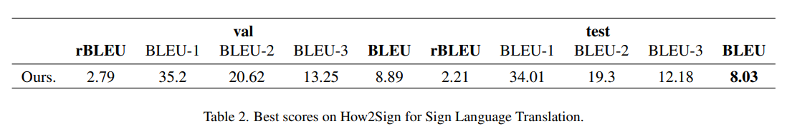
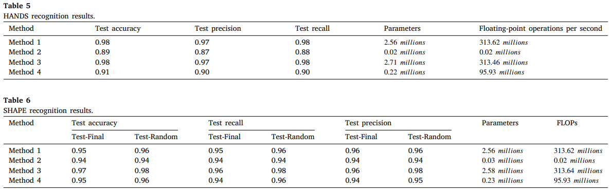
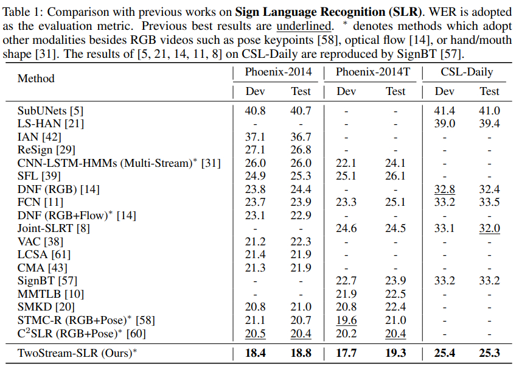
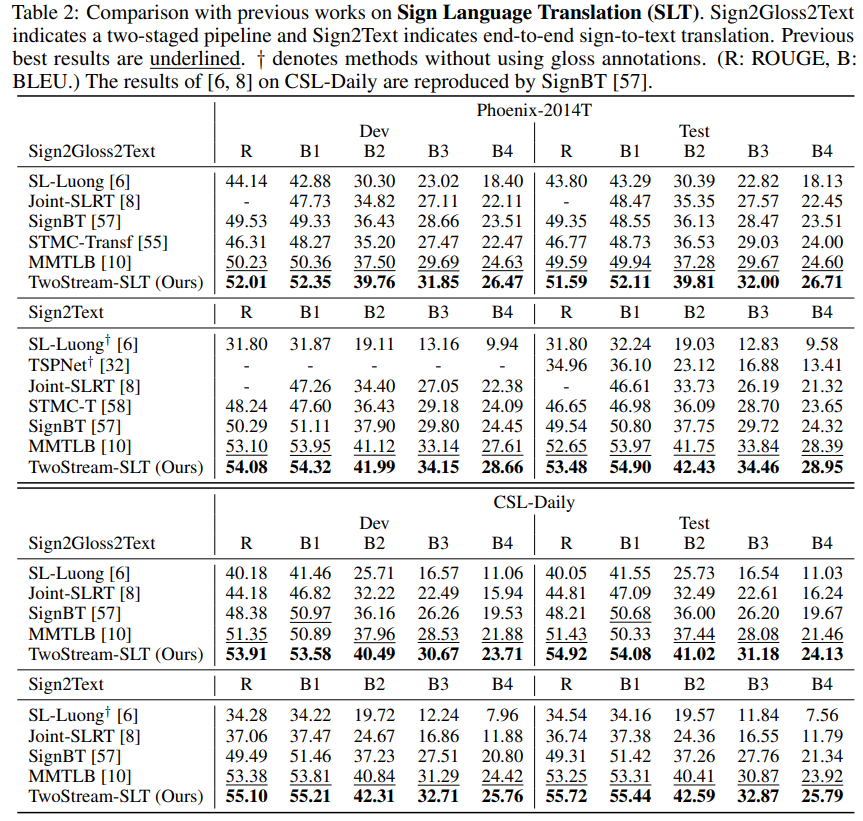
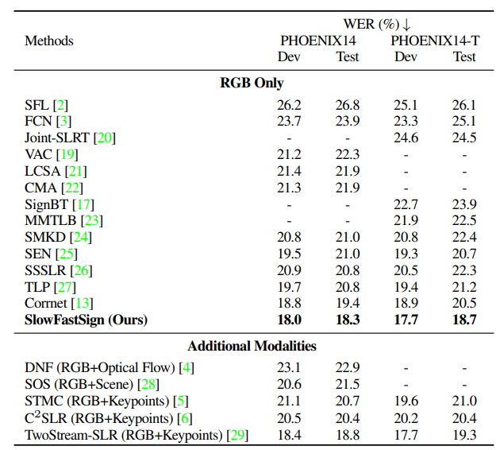
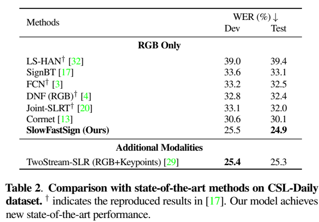
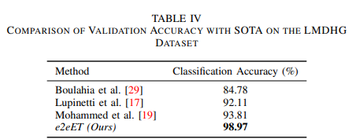
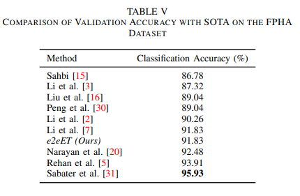
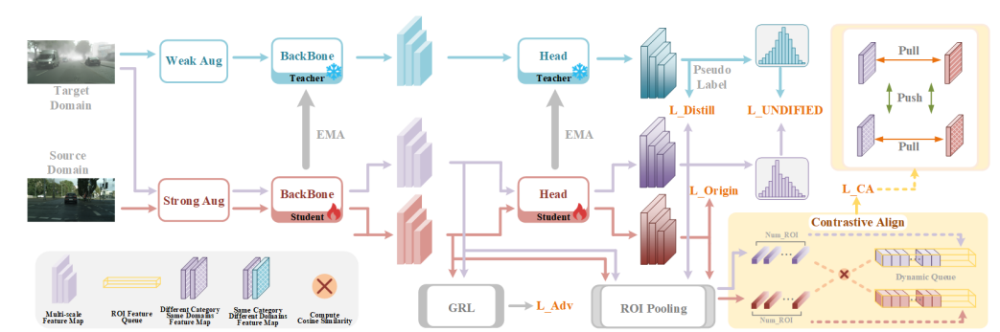

## Papers
[Back](/README.md)

### Image Recognition. 
* **Efficient Net** | EfficientNet: Rethinking Model Scaling for Convolutional Neural Networks (2020) [https://arxiv.org/abs/1905.11946]
    * has been an efficient and accurate benchmark for visual tasks, suitable for using as backbone of downstream fine-tuning tasks.
* **YOLO-v8** | Real-Time Flying Object Detection with YOLOv8 (2024) [https://arxiv.org/abs/2305.09972]
* **YOLO-v11** | YOLOv11: An Overview of the Key Architectural Enhancements (2024) [https://arxiv.org/abs/2410.17725]
  * YOLO-pose for landmark extraction, fine-tunable.

### Other Approaches:
- Gesture Recognition Machine Vision Video Calling Application Using YOLOv8 (2023) [https://doi.org/10.1109/ISCIT57293.2023.10376141]
  - YOLO-v8 used, evaluated on custom dataset
- Sign Language Translation from Instructional Videos (2023) [https://arxiv.org/abs/2304.06371]
  - Transformer model used
  - 

### Contrastive Learning Approaches:
- **Siamese Network** | Siamese Neural Networks for One-Shot Image Recognition (2015) [https://api.semanticscholar.org/CorpusID:13874643]
- **SimCLR** | A Simple Framework for Contrastive Learning of Visual Representations (2020) [https://arxiv.org/abs/2002.05709]
- **MOCO** | Momentum Contrast for Unsupervised Visual Representation Learning (2020) [https://arxiv.org/abs/1911.05722]
- **BYOL** | Bootstrap your own latent: A new approach to self-supervised Learning (2020) [https://arxiv.org/abs/2006.07733]
- **InfoNCE** | InfoNCE: Identifying the Gap Between Theory and Practice (2024) [https://arxiv.org/abs/2407.00143]
- **Triplet Loss** | FaceNet: A unified embedding for face recognition and clustering (2015) [https://doi.org/10.1109/CVPR.2015.7298682]
- **MOCO-v2** | Improved Baselines with Momentum Contrastive Learning (2020) [https://arxiv.org/abs/2003.04297]
- **SwAV** | Unsupervised Learning of Visual Features by Contrasting Cluster Assignments (2021) [https://arxiv.org/abs/2006.09882]
- Supervised Contrastive Learning (2021) [https://arxiv.org/abs/2004.11362]
- **Selectively Hard Triplets Mining** |Selectively Hard Negative Mining for Alleviating Gradient Vanishing in Image-Text Matching (2023) [https://arxiv.org/abs/2303.00181]
- **CLIP-MOE** | CLIP-MoE: Towards Building Mixture of Experts for CLIP with Diversified Multiplet Upcycling (2024) [https://arxiv.org/abs/2409.19291]
- **Survey** | A Survey on Contrastive Self-supervised Learning (2021) [https://arxiv.org/abs/2011.00362]
- **Fisher Discriminant Triplets & Contrastive Losses** | Fisher Discriminant Triplet and Contrastive Losses for Training Siamese Networks (2020) [https://doi.org/10.1109/IJCNN48605.2020.9206833]
- **Feature suppression problem** | Learning the Unlearned: Mitigating Feature Suppression in Contrastive Learning (2024) [https://arxiv.org/abs/2402.11816]
- Article: Types of contrastive learning [https://jxmo.io/posts/contrastive]

### Gesture Recognition:
- **DWPose** | Effective Whole-Body Pose Estimation with Two-Stages Distillation (2023) [https://arxiv.org/abs/2307.15880]
- **MediaPipe** | MediaPipe: A Framework for Building Perception Pipelines (2019) [https://arxiv.org/abs/1906.08172]
- **HR Net** | Deep High-Resolution Representation Learning for Visual Recognition (2020) [https://arxiv.org/abs/1908.07919]
- On-Device Real-Time Hand Gesture Recognition (2021) [https://arxiv.org/abs/2111.00038]
- **SMPL** | SMPL: a skinned multi-person linear model (2015) [https://files.is.tue.mpg.de/black/papers/SMPL2015.pdf]
- **MANO** | Embodied Hands: Modeling and Capturing Hands and Bodies Together (2022) [https://arxiv.org/pdf/2201.02610]

### Keypoint Approaches
- An improved hand gesture recognition system using keypoints and hand bounding boxes (2022) [https://doi.org/10.1016/j.array.2022.100251]
    - Two-Stream approach (Image>CNN + Keypoints>Dense > Concat)
    - evaluated on the HANDS and SHAPE datasets
    - 

### Temporal Approaches:
- TwoStreamNetwork | Two-Stream Network for Sign Language Recognition and Translation (2023) [https://arxiv.org/abs/2211.01367]
  - Image-based, with keypoints as another image stream; Conv-based.
  - SLR:
  - SLT:
- SlowFastSign | Slowfast Network for Continuous Sign Language Recognition (2023) [https://doi.org/10.1109/ICASSP48485.2024.10445841]
  - Added a slow-channel. Conv-based.
  - Slow pathway extracts spatially important features; Fast pathway extracts dynamics with smaller stride.
  - SLR:
- **STGCN** | Spatio-Temporal Graph Convolutional Networks: A Deep Learning Framework for Traffic Forecasting (2018) [https://doi.org/10.24963/ijcai.2018/505]
- **STGCN-GR** | A Spatio-Temporal Graph Convolutional Network for Gesture Recognition from High-Density Electromyography (2023) [https://arxiv.org/abs/2312.00553]
  - Application of STGCN over Gesture Recognition
  - Biological detection rather than focusing on image
- **SignVTCL** | SignVTCL: Multi-Modal Continuous Sign Language Recognition Enhanced by
Visual-Textual Contrastive Learning (2024) [https://arxiv.org/pdf/2401.11847]
  - Multimodal, with landmarks, image, and optical flow augmented.
  - CTC decoder
  - Alignment of multi-modal output and the textual encoder using CLIP-like architecture
  - Use of sign-pyramid network.

### Temporal Contrastive Approaches
- **Contrastive Predictive Coding** | Representation Learning with Contrastive Predictive Coding (2019) [https://arxiv.org/abs/1807.03748]
- **Temporal Contrastive Learning** | TCLR: Temporal contrastive learning for video representation (2022) [https://doi.org/10.1016/j.cviu.2022.103406]
- **e2eET** | Real-Time Hand Gesture Recognition: Integrating Skeleton-Based Data Fusion and Multi-Stream CNN (2024) [https://arxiv.org/abs/2406.15003]
  - GitHub: [https://github.com/Outsiders17711/e2eET-Skeleton-Based-HGR-Using-Data-Level-Fusion]
  - Converted motion data into 2d spatiotemporal RGB representations
  - Evaluated upon DHG1428 Dataset, FPHA Dataset and LMDHG Dataset
  - 
  - 
- Dynamic Hand Gesture Recognition Based on 3D Hand Pose Estimation for Human-Robot Interaction (2022) [https://ieeexplore.ieee.org/stamp/stamp.jsp?tp=&arnumber=9427388]
    - Faster-RCNN, estimate with depth channel, 3dCNN+ConvLSTM
    - Insight for myself: Temporal: 
        - Gesture sequence extracted -> process into discretized "gestures", something like this:
        - 

### Few-shot Learning
- A Transformer-Based Contrastive Learning Approach
for Few-Shot Sign Language Recognition [https://arxiv.org/abs/2204.02803]
  - Transformer + Mediapipe Holistic

### Graph contrastive
- **GraphCL** | Graph Contrastive Learning with Augmentations (2021) [https://arxiv.org/pdf/2010.13902]
- **SkeletonACL** | GRAPH CONTRASTIVE LEARNING FOR SKELETONBASED ACTION RECOGNITION (2023) [https://arxiv.org/pdf/2301.10900]
   - Contrastive loss with memory bank, graph

### YOLO Contrastive
- **CLDA-YOLO** | CLDA-YOLO: Visual Contrastive Learning Based
Domain Adaptive YOLO Detector (2024) [https://arxiv.org/pdf/2412.11812]
  - 
  - Pooling, student-teacher model, distillation loss

### Sign Language Annotation
- **Sign Language Annotation Tool** | Towards Semi-automatic Sign Language Annotation Tool: SLAN-tool (2022) [https://www.sign-lang.uni-hamburg.de/lrec/pub/22030.pdf]
  - Just a tool
- On-device Real-time Custom Hand Gesture Recognition (2023) [https://arxiv.org/abs/2309.10858]
  - Provides a pretrained single-hand embedding model that can be fine-tuned on custom gesture recognition

### Other Papers

- Text to Gesture
  - **Hand1000** | Hand1000: Generating Realistic Hands from Text with Only 1,000 Images (2024)[https://arxiv.org/pdf/2408.15461]
  - **HanDiffuser** | HanDiffuser: Text-to-Image Generation with Realistic Hand Appearances (2024) [https://doi.org/10.1109/CVPR52733.2024.00239]