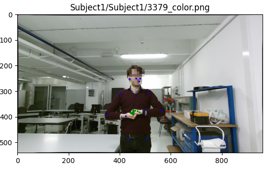
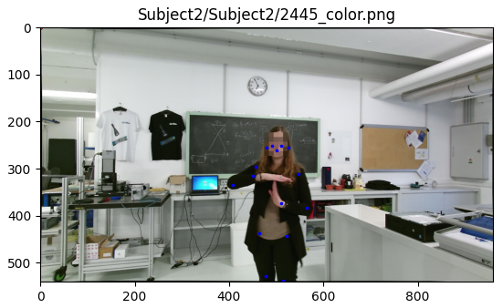
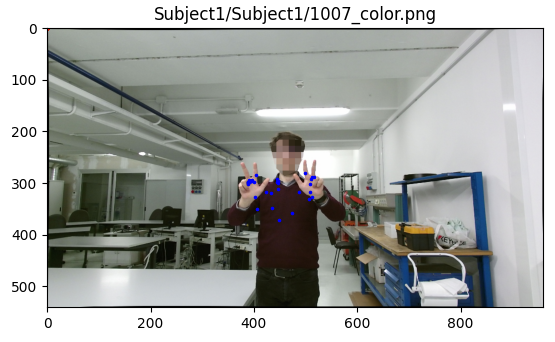
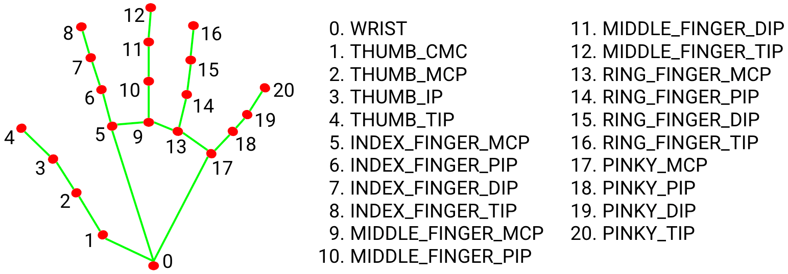
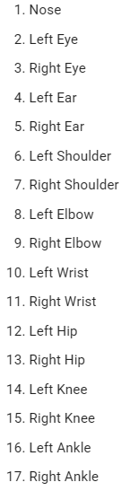
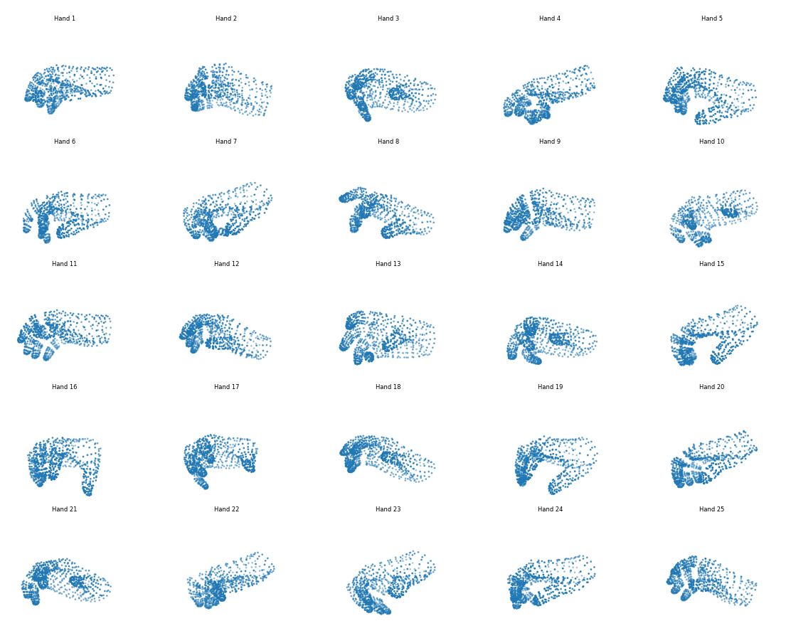

# Progress
[Back](/README.md)

## Data Preprocessing and Cleaning

1) Previously there is a very high rate of detection failures in most datasets, this update attempts to solve this problem.
     - Examples:
       - Missing hand (enhanced with YOLO clipping)
       - Wrongly detected full-body gesture over single-hand images (enhanced with YOLO-pose detection)
2) Fine-tuned YOLO-v11 over hand keypoint detection (trained 100 epochs over the default dataset) | [Source](https://docs.ultralytics.com/datasets/pose/hand-keypoints/#introduction)
3) 

### Methods

1. **Mediapipe for Pose and Hands:**
   - Used Mediapipe's pose and hands detection models on raw images.
   - Output format: `[p0, p1, p2, p3, p4]`
     - `p0`: Total problematic items (any detection issues).
     - `p1`: Only wrong body count.
     - `p2`: Only wrong hand count.
     - `p3`: Both body and hand counts wrong.
     - `p4`: Detections missing (extra detection cases are not counted)

2. **CLAHE for Contrast Improvement:**
   - Applied Contrast Limited Adaptive Histogram Equalization (CLAHE) to enhance image contrast before detection with Mediapipe.

3. **Mixed Approach:**
   - Attempted detection on raw images with Mediapipe first.
   - If detection failed, applied CLAHE and retried with Mediapipe.

4. **YOLO for Pose and Hands:**
   - Used YOLO-pose for body detection and Mediapipe-hands or YOLO-hand for hand detection.
   - Fine-tuned YOLO for hand landmarks detection (100 epochs, results in `runs\train\hand3\weights\best.pt`).

5. **YOLO-Hierarchical:**
   - Used YOLO-pose to detect and clip the largest human region.
   - Applied Mediapipe-hands on the clipped image.
   - If unsuccessful, used fine-tuned YOLO-hand to detect hand bounding boxes, followed by Mediapipe-hands, selecting the best result.

### Results

The table below summarizes the problematic detection ratios for each method across the datasets:

Note: The notation (Name)<sup>#</sup> indicates that the value has been adjusted as it was previously measured incorrectly by not removing the blank class from the "missing detections" count.

| Dataset    | Split | Raw (%) | CLAHE (%) | Mixed (%) | YOLO (%) | YOLO-Hierarchical (%) | YOLO-H-v2 (%) | YOLO-H-v2 (parallelized) (%) | Mediapipe-Holistic (%) | YOLO-H-v2p, fixed with Mediapipe-Holistic (%)
|------------|-------|---------|-----------|-----------|----------|-----------------------|-|-|-|-|
| Lexset     | Train | 10.2<sup>#</sup> | 20.3<sup>#</sup> | 12.1<sup>#</sup> | **5.47**<sup>#</sup>  | *12.4*<sup>#</sup> | **3.00** | | *95.2*
| Lexset     | Test  | 14.7<sup>#</sup> | 20.4<sup>#</sup> | 12.6<sup>#</sup> | **4.89**<sup>#</sup> | *12.7*<sup>#</sup> | **3.19** | **1.81**
| Hands      | -     | 35.6    | 35.6      | -         | 9.98     | **8.40** | **9.98** | **7.22** | **1.51** | **0.00567**
| Senz3d     | -     | 2.30    | 2.30      | -         | 0.23     | **0.00** | **0.08** | **0.00** | *6.89* | 
| Pheonix-2014T Handshapes | Test | - | - | - | - | - | **5.57** | **5.80** | *73.8*
| Pheonix-2014T Handshapes | Train | - | - | - | - | - | *34.5*

### Efficiency

NVIDIA GeForce RTX 4060, 8GB VRAM (Laptop), 32GB RAM

<sup>#</sup>NVIDIA GeForce RTX 3060 Ti, 8GB VRAM (Desktop), 16GB RAM
| Dataset \ Time (hh:mm:ss) | YOLO-H-v2 | YOLO-H-v2 (parallelized, 16 threads) | Mediapipe-Holistic
| --- | -- | -- | -- | 
| Lexset (train) | 45:00 | 36:00 (expected) | 
| Lexset (test)  | 12:16 | 8:18 | 5:40
| Handshape (test) | 7:20<sup>#</sup> | 8:48 | 5:39

**Notes:**
- **Lexset:** Significant improvement with YOLO (9.2% problematic ratio in train split).
- **Hands:** YOLO-Hierarchical achieved the lowest problematic ratio (8.4%) by solving the problem of not able to detect hands with the person only occupying a very small portion of the image, but occlusion is still an issue.
  - Image showcasing the problem (YOLO-H version): 
    - 
    - 
  - Mediapipe Holistic version:
    - 
- **Senz3d:** YOLO-hierachical solved failures in detection.
  - Multi-detection (more than one hands are detected):
    - 
- **LSA64:** The hand is not normal color, cannot detect often.
- **IPN:** Good detection.

## Current Progress and Todos

### Todos

1. **Revisit Datasets:**
   - Perform raw detection of body and hands using Mediapipe and visualize results.
   - **Hand Detection:**
     - Address Mediapipe issues by fine-tuning YOLOv11 over hand keypoints (planned for 100 epochs).
   - **Body Detection:**
     - Use YOLOv11 to improve Mediapipe performance.

2. **Revisit Models:**
   - [Further details to be defined as progress continues.]

3. **Occlusion Handling:**
   - Analyze datasets with full upper body versus single-hand scenarios.
   - Explore training with occlusion to enhance model robustness.
   - Goal: Ensure the model adapts to new tasks seamlessly.

### Tests and Commands

Use the following commands to test and validate the pipeline:

- **Test Feature Extractor:**
  ```python
  python test/test_feature_extractor.py -d <dataset_name> -s <split_name>
  ```
  - Omit `-s` to be prompted for the split name (available options provided).

- **Prepare Dataset:**
  ```python
  python scripts/datasets/prepare_dataset.py <dataset_name>
  ```

- **Verify Failed Detections:**
  - After feature extraction (saved under `data/kpts/`):
    ```python
    python scripts/datasets/dataset_loader.py -d <dataset_name> -s <split_name>
    ```

## Additional Notes

- **Inference Time:** We are evaluating YOLO's inference time, prioritizing the person with the highest hand detection confidence and largest size (not just size alone).
- **Metrics:** Model performance is assessed using mAP50 and mAP50-90.
- **Fine-Tuning:** YOLO fine-tuning for hand detection completed (100 epochs, 9.916 hours), with weights saved at `runs\train\hand3\weights\best.pt`.
- **Occlusion Challenges:** Notable in Senz3d, where YOLO struggles with overlapping keypoints—further investigation needed.
- **Timeline:**
  - 8/3: Data preprocessing and cleaning completed.
  - 9/3: Contrastive pre-training initiated.
  - 14/4: Report deadline.

## Notes:

### Mediapipe keypoints


### YOLO pose keypoints


## MANO augmentations

Source: https://github.com/otaheri/MANO
Source: https://github.com/vchoutas/smplx
Source: https://smpl-x.is.tue.mpg.de/

Installation Steps:
```bash
pip install -r requirements.txt # (chumpy and pyglet)
git clone https://github.com/otaheri/MANO.git
# cd into MANO/
# if the following fails, please go to MANO/setup.py and 
# remove the line "long_description=..." and repeat.
python setup.py install
python setup.py build
# cd back to project root
```
Follow the instructions from [here](https://github.com/otaheri/MANO) to download the model and put into designated folders (go to MODELS & CODE section of [here](https://mano.is.tue.mpg.de/download.php)), unzip the folder, and place in a folder with following structure:
```
model
|
└── mano
    ├── MANO_RIGHT.pkl
    └── MANO_LEFT.pkl
```

### Scripts
`test.py` and `test2.py` under `test/hand_augmentations` samples random hand gestures from the anatomically accurate PCA space. Both hand mesh and landmarks are available, which is good for performing data augmentation and for providing fake data for training the contrastive models.

The sampled keypoints are as follows:


### Generation of Fake Data
The module scripts are under `scripts/fake_data/`.
The training script (infoNCE loss) is under `training/contrastive/`.
* `train_contrastive_fake_data.py`

If marked with an asterisk (\*), the model is trained on 3060 Ti.
| Version | Batch size | Num iters per epoch | Time per epoch | Speed | Updates |
|---|---|---|---|---|---|
| v1-1 | 256 | 10000 | 28s | 1.4it/s |
| v1-2 | 256 | 256000 | 1h 14m 51s | 4.53s/it |
| v1-3 | 256 | 25600 | 7m 40s | 4.73s/it | 
| v1-4 | 256 | 25600 | 1m | 1.4it/s |
| v1-5* | 256 | 25600 | 36s | 2.75it/s | 
| v2-1* | 256 | 25600 | 42s | 2.46it/s | Deeper MLP with BatchNorm (copied from version from last semester)
| v2-2* | 256 | 25600 | 39s | 2.53it/s | With dropout and shallower MLP (3 layers)

#### Results


## SMPL augmentations
Installation Steps:
```bash
pip install -r requirements.txt # (chumpy and pyglet)
git clone https://github.com/vchoutas/smplx.git
# cd into smplx/
python setup.py install
python setup.py build
# cd back to project root
```

For SMPL, download following the instructions [here](https://github.com/vchoutas/smplx) and download the models from [here](https://smpl-x.is.tue.mpg.de/download.php). Unzip the folder and place in a folder with the following structure:
```
models
├── mano
|   ├── MANO_RIGHT.pkl
|   └── MANO_LEFT.pkl
└── smplx
    ├── SMPLX_FEMALE.npz
    ├── SMPLX_FEMALE.pkl
    ├── SMPLX_MALE.npz
    ├── SMPLX_MALE.pkl
    ├── SMPLX_NEUTRAL.npz
    └── SMPLX_NEUTRAL.pkl
```
<!-- 
```
git clone https://github.com/vchoutas/smplify-x
``` -->

### Relevant Ideas
MANO and SMPL are two useful methods for generating realistic gesture landmarks.