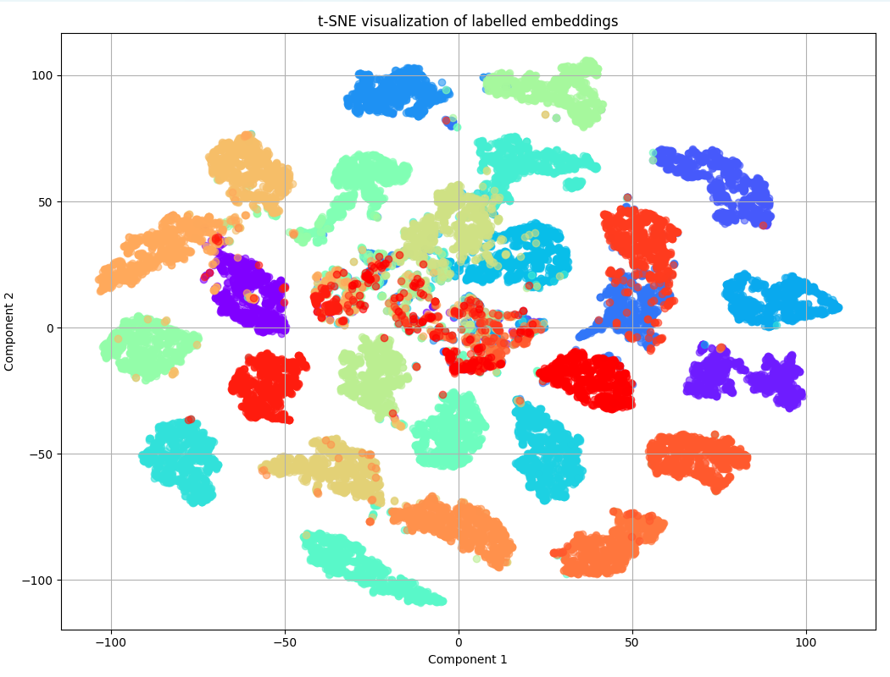
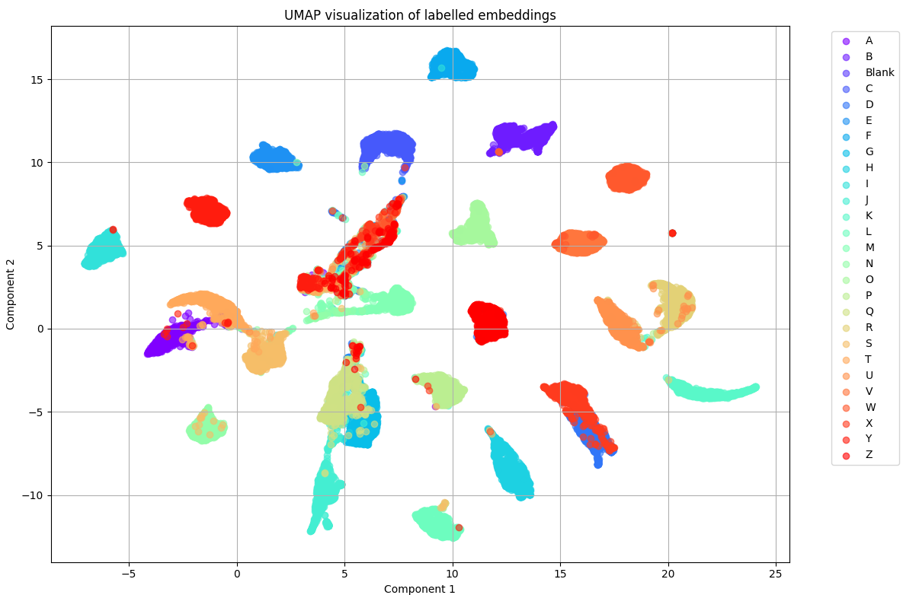
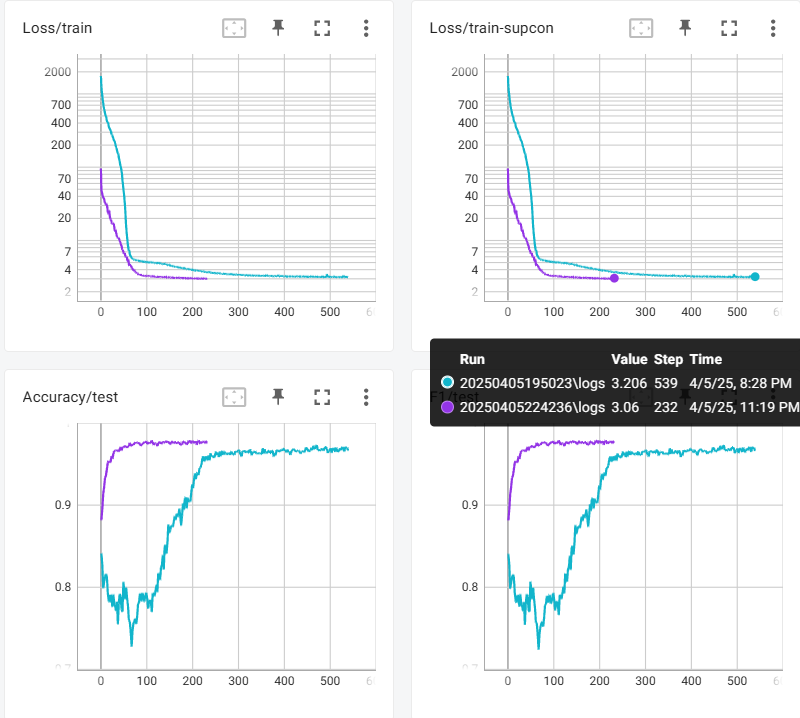
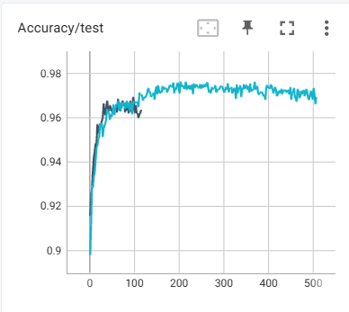
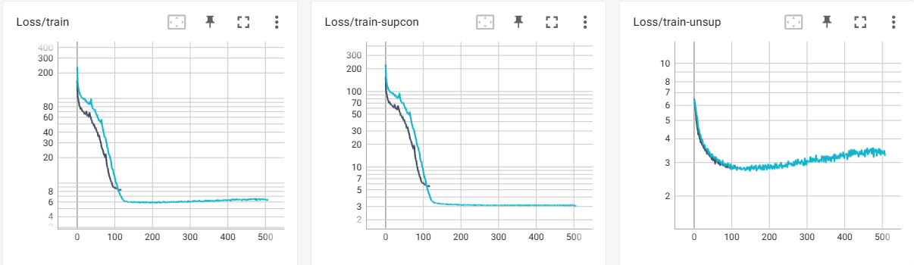
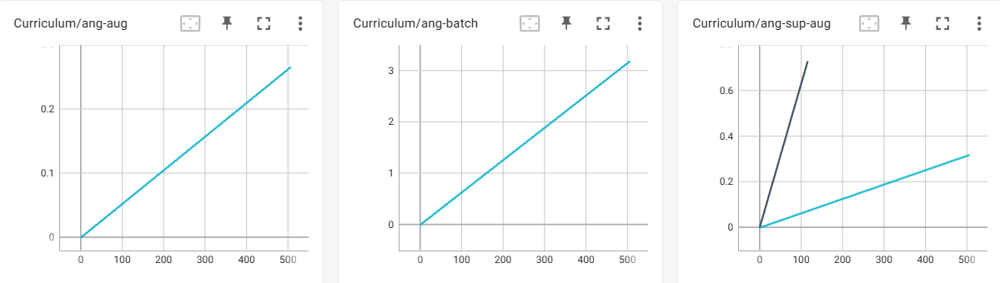

# Progress
[Back](/README.md)

## Data Preprocessing and Cleaning

1) Previously there is a very high rate of detection failures in most datasets, this update attempts to solve this problem.
     - Examples:
       - Missing hand (enhanced with YOLO clipping)
       - Wrongly detected full-body gesture over single-hand images (enhanced with YOLO-pose detection)
2) Fine-tuned YOLO-v11 over hand keypoint detection (trained 100 epochs over the default dataset) | [Source](https://docs.ultralytics.com/datasets/pose/hand-keypoints/#introduction)
3) 

### Methods

1. **Mediapipe for Pose and Hands:**
   - Used Mediapipe's pose and hands detection models on raw images.
   - Output format: `[p0, p1, p2, p3, p4]`
     - `p0`: Total problematic items (any detection issues).
     - `p1`: Only wrong body count.
     - `p2`: Only wrong hand count.
     - `p3`: Both body and hand counts wrong.
     - `p4`: Detections missing (extra detection cases are not counted)

2. **CLAHE for Contrast Improvement:**
   - Applied Contrast Limited Adaptive Histogram Equalization (CLAHE) to enhance image contrast before detection with Mediapipe.

3. **Mixed Approach:**
   - Attempted detection on raw images with Mediapipe first.
   - If detection failed, applied CLAHE and retried with Mediapipe.

4. **YOLO for Pose and Hands:**
   - Used YOLO-pose for body detection and Mediapipe-hands or YOLO-hand for hand detection.
   - Fine-tuned YOLO for hand landmarks detection (100 epochs, results in `runs\train\hand3\weights\best.pt`).

5. **YOLO-Hierarchical:**
   - Used YOLO-pose to detect and clip the largest human region.
   - Applied Mediapipe-hands on the clipped image.
   - If unsuccessful, used fine-tuned YOLO-hand to detect hand bounding boxes, followed by Mediapipe-hands, selecting the best result.

### Results

The table below summarizes the problematic detection ratios for each method across the datasets:

Note: The notation (Name)<sup>#</sup> indicates that the value has been adjusted as it was previously measured incorrectly by not removing the blank class from the "missing detections" count.

| Dataset    | Split | Raw (%) | CLAHE (%) | Mixed (%) | YOLO (%) | YOLO-Hierarchical (%) | YOLO-H-v2 (%) | YOLO-H-v2 (parallelized) (%) | Mediapipe-Holistic (%) | YOLO-H-v2p, fixed with Mediapipe-Holistic (%)
|------------|-------|---------|-----------|-----------|----------|-----------------------|-|-|-|-|
| Lexset     | Train | 10.2<sup>#</sup> | 20.3<sup>#</sup> | 12.1<sup>#</sup> | **5.47**<sup>#</sup>  | *12.4*<sup>#</sup> | **3.00** | **1.86** | *95.2*
| Lexset     | Test  | 14.7<sup>#</sup> | 20.4<sup>#</sup> | 12.6<sup>#</sup> | **4.89**<sup>#</sup> | *12.7*<sup>#</sup> | **3.19** | **1.81**
| Hands      | -     | 35.6    | 35.6      | -         | 9.98     | **8.40** | **9.98** | **7.22** | **1.51** | **0.00567**
| Senz3d     | -     | 2.30    | 2.30      | -         | 0.23     | **0.00** | **0.08** | **0.00** | *6.89* | 
| Pheonix-2014T Handshapes | Test | - | - | - | - | - | **5.57** | **5.80** | *73.8*
| Pheonix-2014T Handshapes | Train | - | - | - | - | - | *34.5*

### Efficiency

NVIDIA GeForce RTX 4060, 8GB VRAM (Laptop), 32GB RAM

<sup>#</sup>NVIDIA GeForce RTX 3060 Ti, 8GB VRAM (Desktop), 16GB RAM
| Dataset \ Time (hh:mm:ss) | YOLO-H-v2 | YOLO-H-v2 (parallelized, 16 threads) | Mediapipe-Holistic
| --- | -- | -- | -- | 
| Lexset (train) | 45:00 | 36:00 (expected) | 
| Lexset (test)  | 12:16 | 8:18 | 5:40
| Handshape (test) | 7:20<sup>#</sup> | 8:48 | 5:39

**Notes:**
- **Lexset:** Significant improvement with YOLO (9.2% problematic ratio in train split).
- **Hands:** YOLO-Hierarchical achieved the lowest problematic ratio (8.4%) by solving the problem of not able to detect hands with the person only occupying a very small portion of the image, but occlusion is still an issue.
  - Image showcasing the problem (YOLO-H version): 
    - 
    - 
  - Mediapipe Holistic version:
    - 
- **Senz3d:** YOLO-hierachical solved failures in detection.
  - Multi-detection (more than one hands are detected):
    - 
- **LSA64:** The hand is not normal color, cannot detect often.
- **IPN:** Good detection.

## Current Progress and Todos

### Todos

1. **Revisit Datasets:**
   - Perform raw detection of body and hands using Mediapipe and visualize results.
   - **Hand Detection:**
     - Address Mediapipe issues by fine-tuning YOLOv11 over hand keypoints (planned for 100 epochs).
   - **Body Detection:**
     - Use YOLOv11 to improve Mediapipe performance.

2. **Revisit Models:**
   - [Further details to be defined as progress continues.]

3. **Occlusion Handling:**
   - Analyze datasets with full upper body versus single-hand scenarios.
   - Explore training with occlusion to enhance model robustness.
   - Goal: Ensure the model adapts to new tasks seamlessly.

### Tests and Commands

Use the following commands to test and validate the pipeline:

- **Test Feature Extractor:**
  ```python
  python test/test_feature_extractor.py -d <dataset_name> -s <split_name>
  ```
  - Omit `-s` to be prompted for the split name (available options provided).

- **Prepare Dataset:**
  ```python
  python scripts/datasets/prepare_dataset.py <dataset_name>
  ```

- **Verify Failed Detections:**
  - After feature extraction (saved under `data/kpts/`):
    ```python
    python scripts/datasets/dataset_loader.py -d <dataset_name> -s <split_name>
    ```

## Additional Notes

- **Inference Time:** We are evaluating YOLO's inference time, prioritizing the person with the highest hand detection confidence and largest size (not just size alone).
- **Metrics:** Model performance is assessed using mAP50 and mAP50-90.
- **Fine-Tuning:** YOLO fine-tuning for hand detection completed (100 epochs, 9.916 hours), with weights saved at `runs\train\hand3\weights\best.pt`.
- **Occlusion Challenges:** Notable in Senz3d, where YOLO struggles with overlapping keypoints—further investigation needed.
- **Timeline:**
  - 8/3: Data preprocessing and cleaning completed.
  - 9/3: Contrastive pre-training initiated.
  - 14/4: Report deadline.

## Notes:

### Mediapipe keypoints


### YOLO pose keypoints


## MANO augmentations

Source: https://github.com/otaheri/MANO
Source: https://github.com/vchoutas/smplx
Source: https://smpl-x.is.tue.mpg.de/

Installation Steps:
```bash
pip install -r requirements.txt # (chumpy and pyglet)
git clone https://github.com/otaheri/MANO.git
# cd into MANO/
# if the following fails, please go to MANO/setup.py and 
# remove the line "long_description=..." and repeat.
python setup.py install
python setup.py build
# cd back to project root
```
Follow the instructions from [here](https://github.com/otaheri/MANO) to download the model and put into designated folders (go to MODELS & CODE section of [here](https://mano.is.tue.mpg.de/download.php)), unzip the folder, and place in a folder with following structure:
```
model
|
└── mano
    ├── MANO_RIGHT.pkl
    └── MANO_LEFT.pkl
```

### Scripts
`test.py` and `test2.py` under `test/hand_augmentations` samples random hand gestures from the anatomically accurate PCA space. Both hand mesh and landmarks are available, which is good for performing data augmentation and for providing fake data for training the contrastive models.

The sampled keypoints are as follows:


### Generation of Fake Data
The module scripts are under `scripts/fake_data/`.
The training script (infoNCE loss) is under `training/contrastive/`.
* `train_contrastive_fake_data.py`

If marked with an asterisk (\*), the model is trained on 3060 Ti.
| Version | Batch size | Num iters per epoch | Time per epoch | Speed | Updates |
|---|---|---|---|---|---|
| v1-1 | 256 | 10000 | 28s | 1.4it/s |
| v1-2 | 256 | 256000 | 1h 14m 51s | 4.53s/it |
| v1-3 | 256 | 25600 | 7m 40s | 4.73s/it | 
| v1-4 | 256 | 25600 | 1m | 1.4it/s |
| v1-5* | 256 | 25600 | 36s | 2.75it/s | 
| v2-1* | 256 | 25600 | 42s | 2.46it/s | Deeper MLP with BatchNorm (copied from version from last semester)
| v2-2* | 256 | 25600 | 39s | 2.53it/s | With dropout and shallower MLP (3 layers)
| v2-3* | 256 | 25600 | 46s | 2.15it/s | 20250324120143: Updated InfoNCE loss calculation.
| v3 | 256|12800 unsupervised, 24300 supervised (lexset)||3.71it/s| SupCon
| v4 | 256|12800 unsupervised, 24300 supervised (lexset)||29it/s| Fake data is pre-generated

#### Results


## SMPL augmentations
Installation Steps:
```bash
pip install -r requirements.txt # (chumpy and pyglet)
git clone https://github.com/vchoutas/smplx.git
# cd into smplx/
python setup.py install
python setup.py build
# cd back to project root
```

For SMPL, download following the instructions [here](https://github.com/vchoutas/smplx) and download the models from [here](https://smpl-x.is.tue.mpg.de/download.php). Unzip the folder and place in a folder with the following structure:
```
models
├── mano
|   ├── MANO_RIGHT.pkl
|   └── MANO_LEFT.pkl
└── smplx
    ├── SMPLX_FEMALE.npz
    ├── SMPLX_FEMALE.pkl
    ├── SMPLX_MALE.npz
    ├── SMPLX_MALE.pkl
    ├── SMPLX_NEUTRAL.npz
    └── SMPLX_NEUTRAL.pkl
```
<!-- 
```
git clone https://github.com/vchoutas/smplify-x
``` -->

### Relevant Ideas
MANO and SMPL are two useful methods for generating realistic gesture landmarks.


PCA, TSNE and UMAP for contrastive supcon+unsupervised: 



## What's NEW

- Pre-generation of contrastive data:
  - `scripts/fake_data/prepare_fake_data_npy.py`, `training/contrastive/train_supcon_1.py`, `augments.py`, `contrastive_data_dataset_3.py`.
    - OUT: runs/hand_contrastive_learning/v4/20250401140023/checkpoints/best.pth
  - `scripts/fake_data/prepare_fake_data_npy_2.py`, `training/contrastive/train_supcon.py`, `augments.py`, `contrastive_data_dataset.py`.
    - Separate rotation and class augmentations and batch them into the SAME infoNCE pass so as to allow the model to learn the two info together.
    - 20250402210020: Rotation 
  - Baseline: Directly use landmarks to evaluate: (none)
    - Lexset: 

```
Test Accuracy: 0.9000
Test F1 Score: 0.8930
Class accu: {0: 0.91, 1: 0.95, 2: 0.97, 3: 0.82, 4: 0.95, 5: 0.96, 6: 0.96, 7: 0.96, 8: 0.95, 9: 0.94, 10: 0.94, 11: 0.94, 12: 0.93, 13: 0.93, 14: 0.96, 15: 0.93, 16: 0.95, 17: 0.96, 18: 0.94, 19: 0.96, 20: 0.91, 21: 0.97, 22: 0.94, 23: 0.87, 24: 0.91, 25: 0.89, 26: 0.0}
Class f1: {0: 0.9528795811518325, 1: 0.9743589743589743, 2: 0.9847715736040609, 3: 0.9010989010989011, 4: 0.9743589743589743, 5: 0.9795918367346939, 6: 0.9795918367346939, 7: 0.9795918367346939, 8: 0.9743589743589743, 9: 0.9690721649484536, 10: 0.9690721649484536, 11: 0.9690721649484536, 12: 0.9637305699481865, 13: 0.9637305699481865, 14: 0.9795918367346939, 15: 0.9637305699481865, 16: 0.9743589743589743, 17: 0.9795918367346939, 18: 0.9690721649484536, 19: 0.9795918367346939, 20: 0.9528795811518325, 21: 0.9847715736040609, 22: 0.9690721649484536, 23: 0.9304812834224598, 24: 0.9528795811518325, 25: 0.9417989417989417, 26: 0.0}
```
  - model_checkpoint_path = 'runs/hand_contrastive_learning_structured/v1/20250403104741/checkpoints/best.pth'
```
Test Accuracy: 0.8967
Test F1 Score: 0.8971
Class accu: {0: 0.9, 1: 0.96, 2: 0.96, 3: 0.79, 4: 0.89, 5: 0.96, 6: 0.98, 7: 0.98, 8: 0.78, 9: 0.83, 10: 0.93, 11: 0.92, 12: 0.89, 13: 0.92, 14: 0.96, 15: 0.88, 16: 0.75, 17: 0.87, 18: 0.91, 19: 0.93, 20: 0.9, 21: 0.98, 22: 0.96, 23: 0.78, 24: 0.72, 25: 0.89, 26: 0.99}
Class f1: {0: 0.9473684210526315, 1: 0.9795918367346939, 2: 0.9795918367346939, 3: 0.8826815642458101, 4: 0.9417989417989417, 5: 0.9795918367346939, 6: 0.98989898989899, 7: 0.98989898989899, 8: 0.8764044943820225, 9: 0.907103825136612, 10: 0.9637305699481865, 11: 0.9583333333333335, 12: 0.9417989417989417, 13: 0.9583333333333335, 14: 0.9795918367346939, 15: 0.9361702127659575, 16: 0.8571428571428571, 17: 0.9304812834224598, 18: 0.9528795811518325, 19: 0.9637305699481865, 20: 0.9473684210526315, 21: 0.98989898989899, 22: 0.9795918367346939, 23: 0.8764044943820225, 24: 0.8372093023255814, 25: 0.9417989417989417, 26: 0.9949748743718593}
```
- Think of a good augmentation and contrastive learning technique.
- UPDATE: Spotted big problem in previous script for generating fake hands (noted: wrong association of landmark ids).
- `scripts/fake_data/prepare_fake_data_npy_3.py`, `training/contrastive/train_supcon.py`, `augments.py`, `contrastive_data_dataset.py`.

- Checking unsupervised and supervised dataset hand formulation: python training/contrastive/test_contrastive_fake_data.py


## MANO features


```
assume z up, this z have nothing to do with the actual coords
0-2: index finger node, rotate (xy) away from thumb, rotate (xz) left/right towards thumb, rotate front/back
3-5: index finger node 2, rotate xy, rotate left/right, rotate forward
6-8: index finger node 3, rotate xy, rotate left/right, rotate forward, 

9-17, same but for middle finger
18-26, same but pinky
27-35, same but second last finger
36-44, same but thumb

2,5,8
```

## Methods

- Problem: Actually the handshapes generated SOMETIMES DO NOT MODEL ALL POSSIBLE STRANGE HANDSHAPES.
- Limitations in hard handshapes.

* KNN results for 3DOF classfier (quat, `eval_dataset` with `get_3dof`):
```
Evaluating the model using k-NN...
Test Accuracy: 0.9130
Test F1 Score: 0.9128
Class accu: {0: 0.90625, 1: 0.8947368421052632, 2: 0.9896907216494846, 3: 0.9186046511627907, 4: 0.8936170212765957, 5: 0.968421052631579, 6: 0.8979591836734694, 7: 0.9896907216494846, 8: 0.9468085106382979, 9: 0.9468085106382979, 10: 0.9375, 11: 0.9263157894736842, 12: 0.8241758241758241, 13: 0.968421052631579, 14: 0.9795918367346939, 15: 0.8315789473684211, 16: 0.8723404255319149, 17: 0.9052631578947369, 18: 0.8210526315789474, 19: 0.8969072164948454, 20: 0.9361702127659575, 21: 0.9680851063829787, 22: 0.9042553191489362, 23: 0.8085106382978723, 24: 0.8837209302325582, 25: 0.9111111111111111}
Class f1: {0: 0.9508196721311476, 1: 0.9444444444444443, 2: 0.9948186528497409, 3: 0.9575757575757575, 4: 0.9438202247191011, 5: 0.983957219251337, 6: 0.946236559139785, 7: 0.9948186528497409, 8: 0.9726775956284153, 9: 0.9726775956284153, 10: 0.967741935483871, 11: 0.9617486338797814, 12: 0.9036144578313253, 13: 0.983957219251337, 14: 0.9896907216494845, 15: 0.9080459770114941, 16: 0.9318181818181817, 17: 0.9502762430939228, 18: 0.9017341040462427, 19: 0.9456521739130435, 20: 0.967032967032967, 21: 0.9837837837837837, 22: 0.9497206703910615, 23: 0.8941176470588236, 24: 0.9382716049382716, 25: 0.9534883720930233}
```

* None:
```
Test Accuracy: 0.9669
Test F1 Score: 0.9669
Class accu: {0: 0.9270833333333334, 1: 0.9789473684210527, 2: 0.9896907216494846, 3: 0.8953488372093024, 4: 0.9680851063829787, 5: 1.0, 6: 0.9795918367346939, 7: 0.9896907216494846, 8: 1.0, 9: 0.9680851063829787, 10: 0.9791666666666666, 11: 0.968421052631579, 12: 0.967032967032967, 13: 0.968421052631579, 14: 0.9795918367346939, 15: 0.9789473684210527, 16: 0.9893617021276596, 17: 0.9578947368421052, 18: 0.9578947368421052, 19: 0.9690721649484536, 20: 0.9468085106382979, 21: 1.0, 22: 0.9680851063829787, 23: 0.8936170212765957, 24: 0.9418604651162791, 25: 0.9666666666666667}
Class f1: {0: 0.9621621621621622, 1: 0.9893617021276596, 2: 0.9948186528497409, 3: 0.9447852760736196, 4: 0.9837837837837837, 5: 1.0, 6: 0.9896907216494845, 7: 0.9948186528497409, 8: 1.0, 9: 0.9837837837837837, 10: 0.9894736842105263, 11: 0.983957219251337, 12: 0.9832402234636871, 13: 0.983957219251337, 14: 0.9896907216494845, 15: 0.9893617021276596, 16: 0.9946524064171123, 17: 0.9784946236559139, 18: 0.9784946236559139, 19: 0.9842931937172775, 20: 0.9726775956284153, 21: 1.0, 22: 0.9837837837837837, 23: 0.9438202247191011, 24: 0.9700598802395208, 25: 0.9830508474576273}
```

* 3DOF:
```
Evaluating the model using k-NN...
Test Accuracy: 0.9273
Test F1 Score: 0.9270
Class accu: {0: 0.8854166666666666, 1: 0.9368421052631579, 2: 0.979381443298969, 3: 0.9418604651162791, 4: 0.9361702127659575, 5: 0.9894736842105263, 6: 0.9081632653061225, 7: 1.0, 8: 0.9787234042553191, 9: 0.9787234042553191, 10: 0.9270833333333334, 11: 0.9368421052631579, 12: 0.8131868131868132, 13: 0.9368421052631579, 14: 0.9693877551020408, 15: 0.8842105263157894, 16: 0.9148936170212766, 17: 0.9052631578947369, 18: 0.8421052631578947, 19: 0.865979381443299, 20: 0.925531914893617, 21: 0.9893617021276596, 22: 0.9468085106382979, 23: 0.8297872340425532, 24: 0.9069767441860465, 25: 0.9777777777777777}
Class f1: {0: 0.9392265193370166, 1: 0.9673913043478259, 2: 0.9895833333333335, 3: 0.9700598802395208, 4: 0.967032967032967, 5: 0.9947089947089947, 6: 0.9518716577540107, 7: 1.0, 8: 0.9892473118279569, 9: 0.9892473118279569, 10: 0.9621621621621622, 11: 0.9673913043478259, 12: 0.896969696969697, 13: 0.9673913043478259, 14: 0.9844559585492226, 15: 0.9385474860335196, 16: 0.9555555555555556, 17: 0.9502762430939228, 18: 0.9142857142857144, 19: 0.9281767955801103, 20: 0.9613259668508287, 21: 0.9946524064171123, 22: 0.9726775956284153, 23: 0.9069767441860465, 24: 0.9512195121951219, 25: 0.9887640449438202}
```

* 6DOF:
```
Test Accuracy: 0.9322
Test F1 Score: 0.9320
Class accu: {0: 0.8958333333333334, 1: 0.9473684210526315, 2: 0.9896907216494846, 3: 0.9418604651162791, 4: 0.925531914893617, 5: 0.9894736842105263, 6: 0.9081632653061225, 7: 1.0, 8: 1.0, 9: 0.9787234042553191, 10: 0.9375, 11: 0.9368421052631579, 12: 0.8131868131868132, 13: 0.9473684210526315, 14: 0.9693877551020408, 15: 0.9052631578947369, 16: 0.9574468085106383, 17: 0.9052631578947369, 18: 0.8526315789473684, 19: 0.865979381443299, 20: 0.9361702127659575, 21: 0.9893617021276596, 22: 0.9361702127659575, 23: 0.8297872340425532, 24: 0.9186046511627907, 25: 0.9555555555555556}
Class f1: {0: 0.9450549450549449, 1: 0.972972972972973, 2: 0.9948186528497409, 3: 0.9700598802395208, 4: 0.9613259668508287, 5: 0.9947089947089947, 6: 0.9518716577540107, 7: 1.0, 8: 1.0, 9: 0.9892473118279569, 10: 0.967741935483871, 11: 0.9673913043478259, 12: 0.896969696969697, 13: 0.972972972972973, 14: 0.9844559585492226, 15: 0.9502762430939228, 16: 0.9782608695652174, 17: 0.9502762430939228, 18: 0.9204545454545454, 19: 0.9281767955801103, 20: 0.967032967032967, 21: 0.9946524064171123, 22: 0.967032967032967, 23: 0.9069767441860465, 24: 0.9575757575757575, 25: 0.9772727272727273}
```

* No aug, 500 epochs, HandEncoder
```
Test Accuracy: 0.9751
Test F1 Score: 0.9750
Class accu: {0: 0.9791666666666666, 1: 0.9789473684210527, 2: 1.0, 3: 0.9186046511627907, 4: 0.9893617021276596, 5: 0.9894736842105263, 6: 0.9897959183673469, 7: 1.0, 8: 1.0, 9: 0.9468085106382979, 10: 1.0, 11: 0.968421052631579, 12: 1.0, 13: 0.9789473684210527, 14: 1.0, 15: 0.968421052631579, 16: 0.9893617021276596, 17: 0.9789473684210527, 18: 0.968421052631579, 19: 0.979381443298969, 20: 0.9680851063829787, 21: 1.0, 22: 1.0, 23: 0.8404255319148937, 24: 0.9418604651162791, 25: 0.9666666666666667}
Class f1: {0: 0.9894736842105263, 1: 0.9893617021276596, 2: 1.0, 3: 0.9575757575757575, 4: 0.9946524064171123, 5: 0.9947089947089947, 6: 0.994871794871795, 7: 1.0, 8: 1.0, 9: 0.9726775956284153, 10: 1.0, 11: 0.983957219251337, 12: 1.0, 13: 0.9893617021276596, 14: 1.0, 15: 0.983957219251337, 16: 0.9946524064171123, 17: 0.9893617021276596, 18: 0.983957219251337, 19: 0.9895833333333335, 20: 0.9837837837837837, 21: 1.0, 22: 1.0, 23: 0.9132947976878613, 24: 0.9700598802395208, 25: 0.9830508474576273}
```

* `train_supcon.py` on desktop before 202504031508.
* using `train_unsup.py` on desktop (before 20250404163732).
* `train_supcon_gat.py` and `train_unsup_gat.py` (have text logs).
* Direction: Larger datasets needed?
* `train_supcon_gat.py` with GAT3dof: 20250405211305 on desktop, all only supcon with lexset train
* `train_supcon_gat.py` with GCN3dof: 20250405204003 on laptop, all only supcon with lexset train

### BASELINES:

* None:
  * handshape:
* 3dof:
  * handshape:
* 6dof:
  * handshape: 

### PRELIMINARY TRAINING (PROOF OF CONVERGENCE):

* Train on lexset, supcon, no aug.
* Hyper-parameter tuning.
* `train_supcon_gat.py`
* 20250405195023: HandEncoder (MLP), laptop, 96.95% lexset test, F1 96.62%, 4.2s/ep (blue), ~250ep converge
  * handshape: 
* 20250405224236: HandEncoderGCN3dof (no pool), laptop, 97.67% lexset test, F1 97.72%, 10s/ep (purple), ~100ep converge
  * handshape: 
* 
* 20250405222858: HandEncoderGAT3dof (no pool), desktop, 96.12% lexset test, overfit (test acc goes down), F1 96.5%, 4.5s/ep, ~100ep converge
* 20250405231456: HandEncoderGAT6dof (no pool), desktop, 97.73% lexset test, F1 97.88%, 4.82s/ep (rose), ~200ep converge
* 20250406000135: HandEncoderGCN6dof (no pool), laptop, 98.2% lexset test, F1 98.21%, (lime), ~200ep convergence, ~1000ep good.

### PRELIMINARY TRAINING (Curriculum Training):

* `train_supcon_gat_curriculum` [dosup=True, dounsup=True] Augmentation with linear curriculum scheduling, No pool, 4->3 layers
* 20250406164630: HandEncoderGCN6dof, laptop, max 96.77 (397ep), 
  * 
* 20250406185135: HandEncoderGAT6dof, desktop, max 96.69 (197ep)
* 20250407143513: `Model class: HandEncoderGCN6dof (train_supcon_gat_curriculum) [dosup=True, dounsup=True] Augmentation with linear curriculum scheduling (sup: use sup_aug_schedule: 0..2pi (10k ep*fixed), unsup: 0..2pi, 0..pi/6 (1k ep); do_norm_after_output=True), No pool, 4->3 layers`
  * 
  * 
  * 

20250407143602: 

